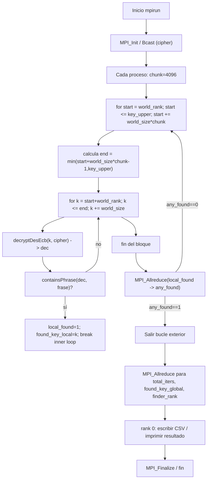

# Estrategia paralela seguida en `impl1` - bucles por chunk + `MPI_Allreduce`

Se paraleliza la búsqueda por fuerza bruta usando un reparto *block-cyclic* por **turnos/chunks** es decir que cada proceso procesa, por turnos, bloques de `chunk` claves intercaladas con paso `P` dentro de ventanas de tamaño `chunk*P` y después de completar su bloque hace una reducción colectiva para comprobar si se debe detener. La exploración local se realiza mediante bucles for.

## Detalle de la estrategia

1. **Reparto de trabajo — block-cyclic por *chunk*.**

   - `const uint64_t chunk = 4096ULL;` (definición del tamaño de bloque).
   - El bucle externo salta por ventanas: `for (uint64_t start = (uint64_t)world_rank; start <= key_upper; start += world_size * chunk)` y calcula `end = start + world_size*chunk - 1` (ajustando con `key_upper`).
   - Dentro de la ventana, cada proceso prueba claves `k` con paso `world_size`: `for (uint64_t k = start + (uint64_t)world_rank; k <= end; k += (uint64_t)world_size)`.
   - Esto produce un reparto **intercalado por procesos dentro de bloques**: cada bloque tiene `world_size * chunk` claves, y dentro del bloque cada rank toma claves separadas por `world_size`.

2. **Bucle de prueba local (pure `for`) y rutinas usadas (líneas relevantes).**

   - Por cada `k` se hace:

     - `decryptDesEcb(k, cipher, cipher_len, &dec, &dec_len)` → descifrado que asigna `dec`.
     - `containsPhrase(dec, dec_len, frase)` → búsqueda de la frase (usa internamente `memcpy` + `strstr`).
     - Liberar `dec`.
   - Estas llamadas aparecen en el interior del `for` y son las que realizan el trabajo “pesado” por clave.

    Todo es **bucles `for`** la sincronización ocurre vía colecciones `MPI_Allreduce` tras cada bloque.

3. **Detección temprana y sincronización — `MPI_Allreduce` como mecanismo de parada.**

   - Tras completar cada bloque (la iteración del `for` externo), cada proceso hace:

     ```c
     int any_found = 0;
     MPI_Allreduce(&local_found, &any_found, 1, MPI_INT, MPI_MAX, MPI_COMM_WORLD);
     if (any_found) break;
     ```

     (esto comprueba si **cualquiera** encontró la frase y ordena a todos terminar).
   - Al final se consolidan métricas con `MPI_Allreduce`/`MPI_Allreduce`/`MPI_Allreduce` (iteraciones totales, clave mínima encontrada y rank ganador) y se usan esos resultados para registro e impresión.

   **Por qué `Allreduce`:** evita la necesidad de enviar mensajes punto a punto para notificar parada; es una operación colectiva con coste previsble y que devuelve el OR/MAX global de la bandera `found`.

4. **Líneas responsables:**

   - `chunk` y los bucles `start` / `k` (reparto block-cyclic): ver `impl1_par.c` — definición `const uint64_t chunk = 4096ULL;` y los bucles `for (uint64_t start = (uint64_t)world_rank; ...)` y `for (uint64_t k = start + (uint64_t)world_rank; k <= end; k += (uint64_t)world_size)` .
   - Descifrado y chequeo de frase: llamadas a `decryptDesEcb(...)` y `containsPhrase(...)` dentro del bucle interior.
   - Sincronización / parada temprana: `MPI_Allreduce(&local_found, &any_found, 1, MPI_INT, MPI_MAX, MPI_COMM_WORLD); if (any_found) break;`.
   - Consolidación final de métricas: `MPI_Allreduce(&local_iters, &total_iters, ...)` y `MPI_Allreduce(&found_key_local, &found_key_global, ...)` y reducción para `finder_rank`.

5. **Patrones de comunicación:**

   - **Broadcast inicial:** `MPI_Bcast` del `cipher`/tamaño en el path de `encrypt`/`decrypt` (para compartir el dato a todos).
   - **Colecciones (`MPI_Allreduce`)** tras cada bloque y al final para detectar parada y agregar métricas.
   - **No hay envíos punto-a-punto para parada** en `impl1_par` (p. ej. `MPI_Send`/`MPI_Irecv` no se usan aquí para notificar). Si comparas, `bruteforce.c` usa `MPI_Irecv` + `MPI_Send` para notificación directa.

## Ventajas y limitaciones del enfoque usado

- **Ventajas**

  - Balance: el block-cyclic por *chunk* amortigua desbalances y permite que cada proceso haga trabajo suficiente entre sincronizaciones.
  - Comunicación: `MPI_Allreduce` evita ráfagas de mensajes punto a punto cuando la detección temprana es poco frecuente.

- **Limitaciones**

  - Latencia de parada: la notificación de que otro proceso encontró la clave sólo se propaga en la siguiente `Allreduce` (fin de chunk), por lo que puede haber *overwork* (trabajo inútil) hasta que la reducción se haga efectiva.
  - Overhead de `Allreduce` si `chunk` es muy pequeño (sincronizaciones frecuentes) o si la comunicación es lenta.
  - Copias/desempeño por intento: cada intento realiza `decryptDesEcb` que asigna `dec` en heap y `containsPhrase` hace `memcpy` internamente; esto genera presión de memoria/GC y coste por clave. Posible optimización: buffer reutilizable y evitar malloc/free por intento.


