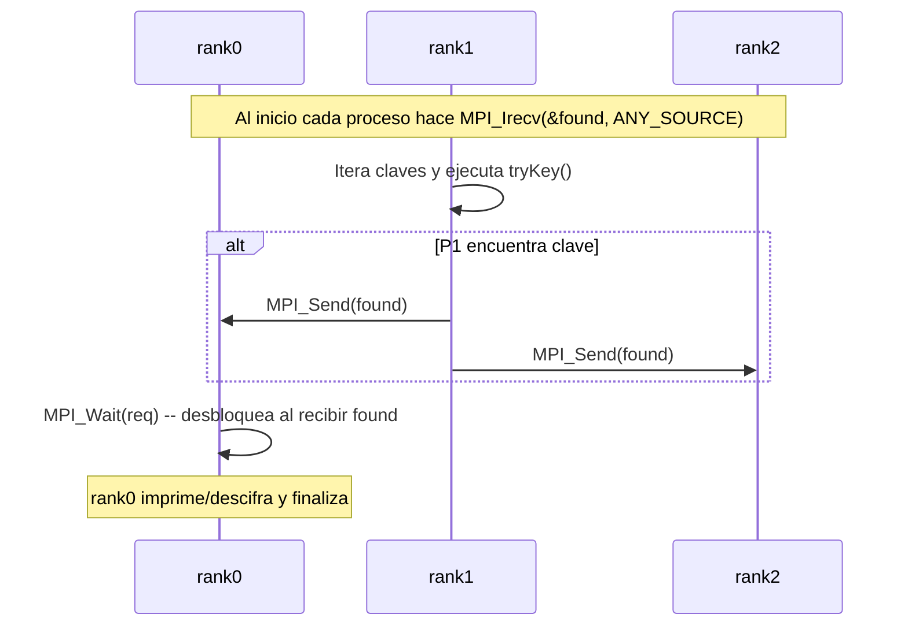

# Flujo y uso de primitivas MPI (en el código base `bruteforce.c` y patrón `impl1_par`)

## 1. `MPI_Irecv`

- **Qué hace:** inicia una recepción **no bloqueante**; retorna inmediatamente y deja la recepción en progreso.
- **Uso en el código:**

  - Cada proceso hace `MPI_Irecv(&found, 1, MPI_LONG, MPI_ANY_SOURCE, MPI_ANY_TAG, comm, &req);` antes de entrar al bucle.
  - Objetivo: permitir que cada proceso detecte asíncronamente que otro proceso ya encontró la clave sin bloquear su computación.
- **Comportamiento operativo:**

  - Mientras el proceso prueba claves localmente puede consultar la variable `found` (que cambia sólo cuando la recepción se completa).
  - La finalización se detecta mediante `MPI_Wait(&req, &st)` (o chequear `found` en su bucle si se combina con progreso de MPI).

## 2. `MPI_Send`

- **Qué hace:** envío **bloqueante** (por defecto) de un mensaje a otro proceso.
- **Uso en el código:**

  - Cuando un proceso detecta la clave correcta hace:

    ```c
    for(node=0; node<N; node++){
      MPI_Send(&found, 1, MPI_LONG, node, 0, MPI_COMM_WORLD);
    }
    ```

  - Envía el valor encontrado a **cada** proceso para notificar parada.
- **Motivación y efecto:**

  - Garantiza entrega del valor `found` (bloquea hasta que el mensaje esté en buffer del sistema o haya sido recibido).
  - Simple y robusto; coste: O(N) envíos (uno por receptor), lo que puede ser ineficiente a gran escala.

## 3. `MPI_Wait`

- **Qué hace:** espera hasta que una operación no bloqueante (p. ej. `MPI_Irecv`) que devuelve una `MPI_Request` complete.
- **Uso en el código:**

  - En el `id==0` (o proceso que debe finalizar con el resultado) se hace `MPI_Wait(&req, &st);` tras el bucle — de este modo espera la notificación de cualquier nodo que haya encontrado la clave.
- **Comportamiento:**

  - Bloquea hasta que el mensaje entrante haya sido totalmente recibido; luego se puede leer `found` con el valor recibido.
  - Permite que un proceso se dedique a computación mientras existe la recepción pendiente (progreso interrumpido por la implementación de MPI o periódicamente por llamadas que realizan progreso).


