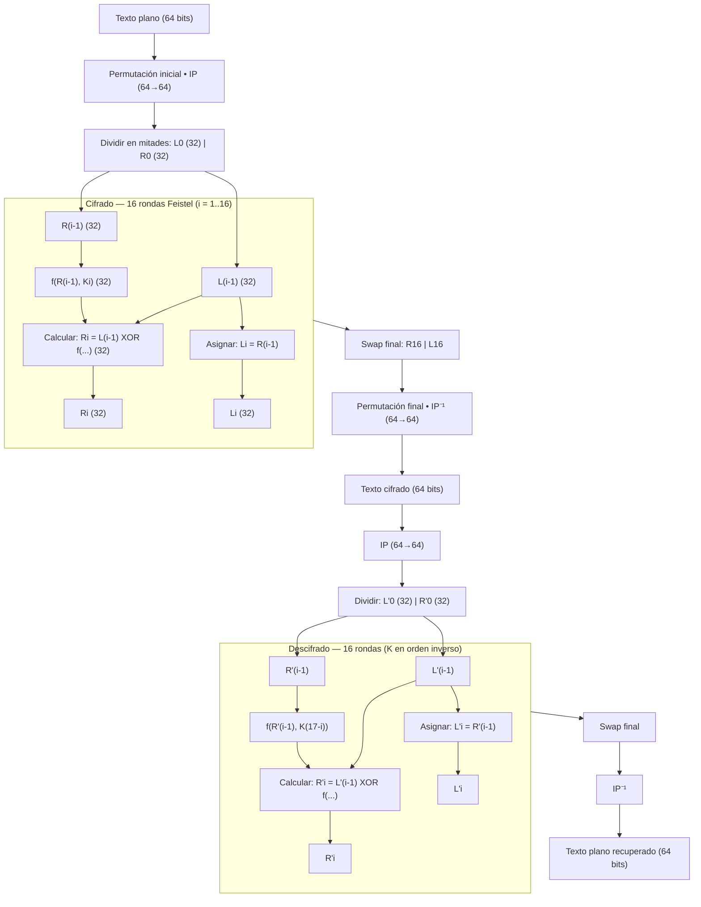
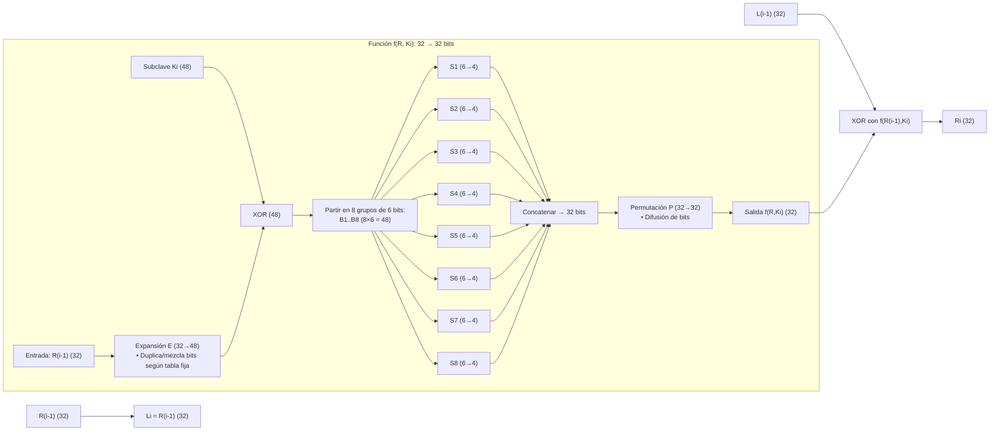
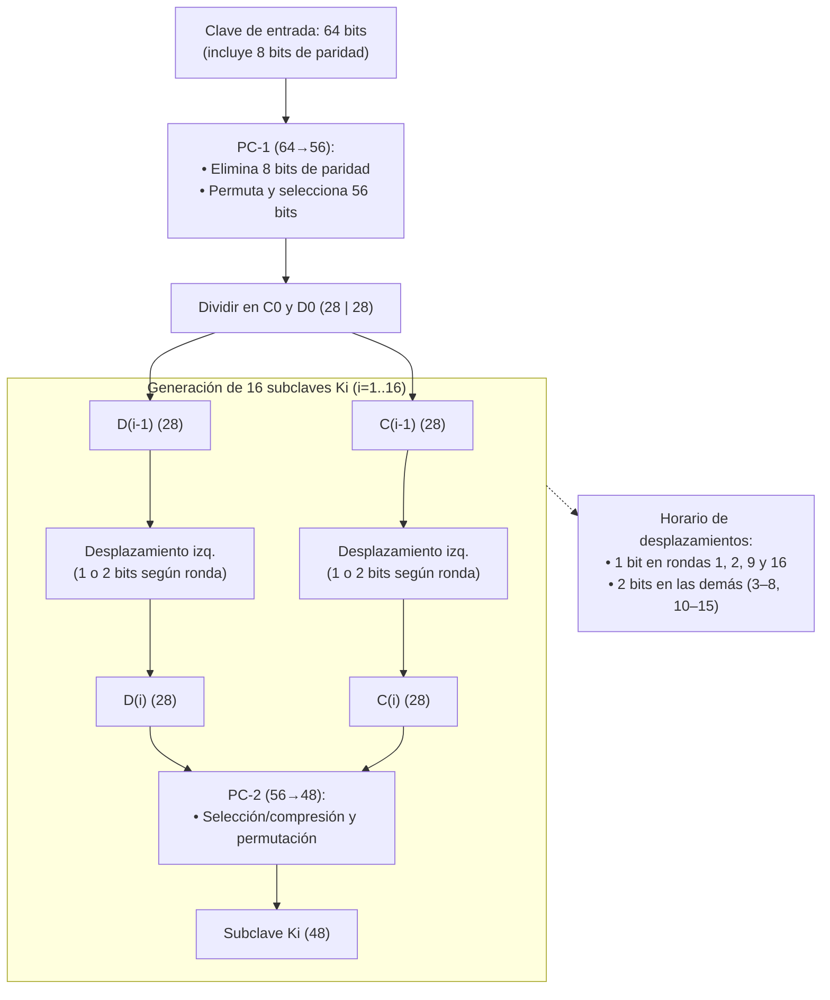

# Algoritmo DES

El **Data Encryption Standard (DES)** es un algoritmo de cifrado **simétrico** desarrollado en la década de 1970 por el gobierno de los Estados Unidos para proteger información sensible del gobierno y las fuerzas armadas [2]. Posteriormente fue adoptado ampliamente en sectores comerciales y tecnológicos debido a su eficacia y facilidad de implementación.

A pesar de su importancia histórica, el DES hoy se considera **obsoleto** debido a la evolución de la capacidad computacional y los avances en criptografía, que lo han hecho vulnerable a ataques de fuerza bruta y criptoanálisis [2][1].

## Fundamentos del cifrado de datos

El **cifrado de datos** consiste en convertir información legible (*plaintext*) en un formato ilegible (*ciphertext*), garantizando que solo los usuarios autorizados con la clave de descifrado puedan acceder a la información original. Este proceso protege datos en tránsito y en reposo, asegurando la **confidencialidad e integridad** de la información [1].

Existen dos tipos principales de cifrado:

- **Simétrico:** usa la misma clave para cifrar y descifrar. Ejemplo: DES, AES.
- **Asimétrico:** usa un par de claves (pública y privada). Ejemplo: RSA, ECC.

El DES pertenece al primer tipo: **cifrado simétrico por bloques**.

## Estructura del DES

El DES trabaja sobre bloques de **64 bits de datos** y emplea una **clave de 56 bits** (más 8 bits de paridad que no participan en el cifrado). Su proceso consta de múltiples etapas diseñadas para mezclar, permutar y transformar los bits de manera que el resultado sea difícil de revertir sin la clave correcta [2].

### 1. Entrada de datos

Se toma un bloque de 64 bits del texto plano y se divide en dos mitades de 32 bits cada una.

### 2. Generación de subclaves

A partir de la clave de 56 bits, se generan **16 subclaves de 48 bits**, una para cada ronda del proceso. Esto se logra mediante **permutaciones y desplazamientos** de bits.

### 3. Rondas de cifrado (Feistel Network)

El DES utiliza una estructura **Feistel**, que aplica 16 rondas idénticas con una subclave diferente en cada una. Cada ronda incluye los siguientes pasos:

1. **Expansión:** la mitad derecha (32 bits) se expande a 48 bits mediante una tabla de expansión.
2. **XOR con la subclave:** se combina con la subclave correspondiente usando la operación XOR.
3. **Sustitución (S-Box):** los 48 bits se dividen en 8 grupos de 6 bits. Cada grupo pasa por una **S-Box**, que realiza una sustitución no lineal, reduciendo el resultado a 32 bits.
4. **Permutación (P-Box):** los 32 bits resultantes se reordenan según una tabla fija.
5. **Combinación y swap:** la salida se combina mediante XOR con la mitad izquierda y luego las mitades se intercambian.

### 4. Ronda final

Tras las 16 rondas, las mitades se intercambian nuevamente, completando el bloque cifrado de **64 bits**.

### 5. Descifrado

El descifrado aplica el mismo proceso en orden inverso, utilizando las subclaves en sentido contrario.

## Seguridad del DES

En su momento, DES fue considerado seguro; sin embargo, su **clave de 56 bits** hoy es insuficiente. Los ataques de fuerza bruta modernos pueden probar todas las combinaciones posibles en pocas horas o incluso minutos [2]. En 1998, la Electronic Frontier Foundation (EFF) logró romper una clave DES en menos de tres días, demostrando su vulnerabilidad práctica.

Para mitigar este problema, se desarrolló el **Triple DES (3DES)**, que aplica el algoritmo tres veces con diferentes claves, incrementando su seguridad. Aun así, 3DES también ha sido **deprecado** por estándares modernos como el AES [1].

## Comparación entre AES y DES

| Característica | **DES** | **AES** |
|----------------|----------|----------|
| Tipo | Simétrico por bloques | Simétrico por bloques |
| Tamaño de bloque | 64 bits | 128 bits |
| Longitud de clave | 56 bits | 128, 192 o 256 bits |
| Rondas | 16 | 10, 12 o 14 |
| Seguridad | Débil ante ataques de fuerza bruta | Alta seguridad comprobada |
| Estado actual | Obsoleto | Estándar moderno de cifrado |

AES fue adoptado por el **NIST** como reemplazo oficial de DES, ya que ofrece **mayor seguridad y eficiencia** en hardware y software [1][2].

## Diagramas

### Proceso general Cifrado/Descifrado

Este diagrama muestra cómo DES transforma un bloque de texto plano de 64 bits en un texto cifrado de 64 bits mediante una serie de permutaciones y 16 rondas de cifrado tipo Feistel.

#### Etapas

- **Texto plano (64 bits)** → Entrada inicial de datos que se van a cifrar.
- **Permutación inicial (IP)** → Reordena los bits del bloque según una tabla predefinida. No añade seguridad por sí sola, pero prepara los datos para las rondas.
- **División en mitades** → El bloque se separa en dos partes de 32 bits: `L0` (izquierda) y `R0` (derecha).

#### Rondas de cifrado (16 rondas Feistel)

Cada ronda aplica una **subclave distinta (Ki)** generada previamente:

1. `Li = R(i-1)`
2. `Ri = L(i-1) XOR f(R(i-1), Ki)`

La mitad derecha se transforma con la función `f` y se combina con la izquierda mediante XOR. Luego se intercambian las mitades (swap).
Este proceso se repite **16 veces**, aumentando la difusión y confusión de los datos.

- **Swap final:** tras las 16 rondas, se intercambian las mitades por última vez.
- **Permutación final (IP⁻¹):** se aplica la permutación inversa de la inicial para obtener el **texto cifrado (64 bits)**.

#### Descifrado

El flujo es **idéntico** al del cifrado, pero aplicando las subclaves en **orden inverso (K16 → K1)**.
Esto se debe a la estructura Feistel, que permite usar el mismo mecanismo tanto para cifrar como para descifrar.

### Función interna $f(R,Ki)$

Este segundo diagrama detalla el **núcleo de transformación** del algoritmo DES.
Es la parte más importante, donde se logra la complejidad del cifrado.

#### Pasos de la función

1. **Expansión E (32→48 bits)**
   La mitad derecha de 32 bits (`R(i-1)`) se expande a 48 bits. Esto duplica algunos bits y reordena otros, creando redundancia.

2. **XOR con subclave (Ki)**
   Los 48 bits expandidos se combinan con la subclave de la ronda mediante XOR, mezclando los datos con la clave.

3. **S-Boxes (Sustitución 8×[6→4])**
   Los 48 bits se dividen en 8 grupos de 6 bits.
   Cada grupo pasa por una **S-Box**, una tabla no lineal que sustituye cada 6 bits por 4 bits.
   → Esto introduce **no linealidad**, esencial para impedir que el cifrado sea predecible.

4. **Concatenación**
   Las 8 salidas de las S-Boxes (8×4 = 32 bits) se unen nuevamente.

5. **Permutación P (32→32 bits)**
   Los 32 bits finales se reordenan mediante una **P-Box**, que distribuye los bits entre posiciones distintas para mejorar la difusión.

6. **Salida f(R, Ki)**
   El resultado (32 bits) se combina con la mitad izquierda (`L(i-1)`) en la estructura Feistel.

Esta función es la responsable de la **seguridad interna del DES**, ya que mezcla bits de los datos y de la clave de manera compleja.

### Generación de claves

El tercer diagrama explica cómo se generan las **16 subclaves (Ki)** de 48 bits a partir de la clave original de 64 bits.

### Etapas

1. **Clave inicial (64 bits)**
   Contiene 8 bits de paridad (1 por cada byte). Solo 56 bits se usan efectivamente para el cifrado.

2. **Permutación PC-1 (64→56 bits)**
   Elimina los bits de paridad y reordena los 56 bits restantes.

3. **División de la clave en dos mitades:**
   `C0` y `D0`, cada una de 28 bits.

4. **Desplazamientos (rotaciones a la izquierda)**
   En cada ronda, `C` y `D` se rotan 1 o 2 bits a la izquierda dependiendo del número de ronda.

   - 1 bit: rondas 1, 2, 9, 16
   - 2 bits: las demás (3–8, 10–15)

5. **Permutación PC-2 (56→48 bits)**
   De los 56 bits combinados (C + D), se seleccionan 48 bits en posiciones específicas.
   El resultado es la subclave `Ki` usada en la ronda i.

Estas 16 subclaves se aplican **en orden directo** durante el cifrado y **en orden inverso** durante el descifrado.

## Referencias

- [Data Encryption: What It Is, How It Works, and Best Practices](https://frontegg.com/blog/data-encryption-what-it-is-how-it-works-and-best-practices)  
- [¿Qué es el DES?](https://msmk.university/que-es-el-des-msmk-university/)

[1]:https://frontegg.com/blog/data-encryption-what-it-is-how-it-works-and-best-practices "Data Encryption: What It Is, How It Works, and Best Practices"

[2]:https://msmk.university/que-es-el-des-msmk-university/ "¿Qué es el DES?"
