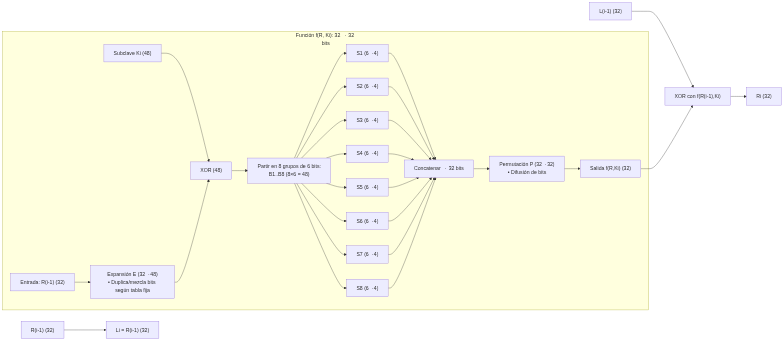
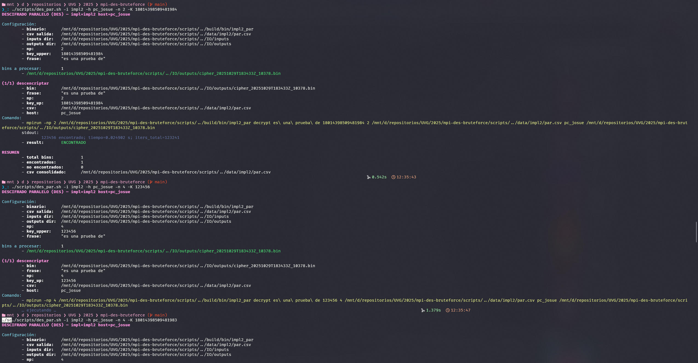
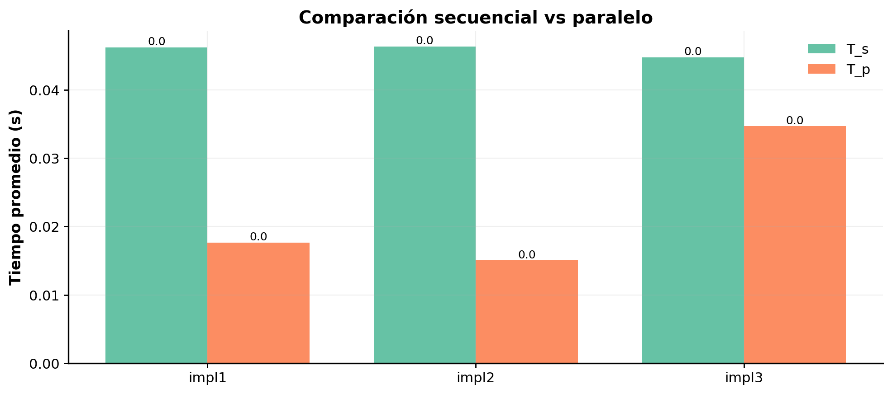
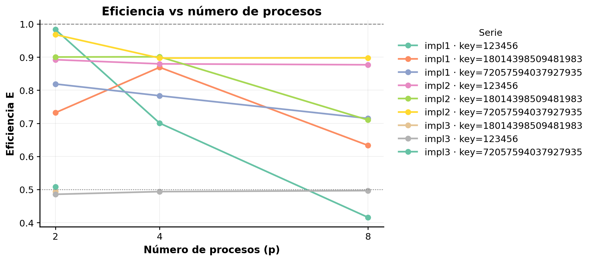
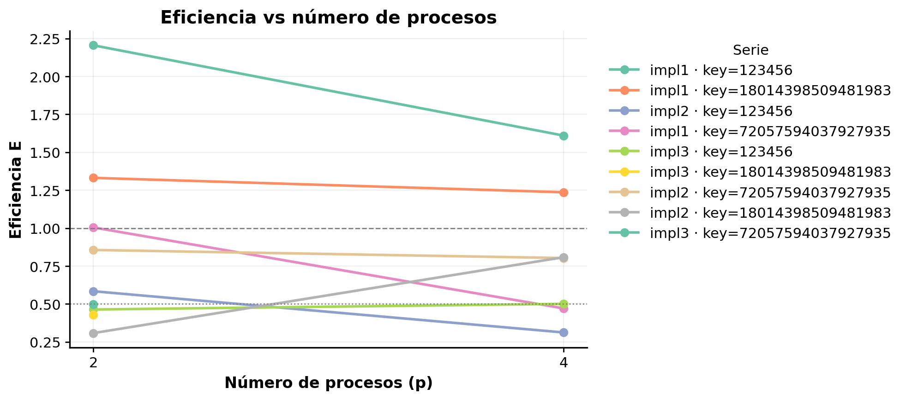

# Índice

1. [Introducción](#introducción)
2. [Antecedentes](#antecedentes)
   1. [Explicación DES](#fundamentos-del-cifrado-de-datos)
   1. [Fundamentos DES](#des--data-encryption-standard)
   1. [Estructara DES](#estructura-del-des)
   1. [Seguridad DES](#seguridad-del-des)
   1. [Comparación DES](#comparación-entre-aes-y-des)
   1. [Diagramas](#diagramas)
3. [Descripción de rutinas DES](#descripción-de-rutinas)
4. [Flujo de rutinas en "Bruterforce"](#flujo-y-uso-de-primitivas-mpi-en-el-código-base-bruteforcec-y-patrón-impl1_par)
5. [Soluciones propuestas](#soluciones-propuestas)
   1. [Fuerza Bruta](#enfoque-1--impl1)
   1. [Solución AltA](#enfoque-2--impl2)
   1. [Solución Master Worker](#enfoque-3--impl3)
   1. [Llaves utilizadas](#pruebas-con-llaves-fáciles-medianas-y-difíciles)
   1. [Comparación general](#comparación-general)
   1. [Síntesis para resultados con p=4](#síntesis-de-resultados-a-p--4)
6. [Resultados](#resultados)
   1. [Discusión](#discusión)
   1. [Conclusiones](#conclusiones)
   1. [Recomendaciones](#recomendaciones)
7. [Anexo 1 — Catálogo de funciones y librerías](#anexo-1--catálogo-de-funciones-y-librerías)
8. [Anexo 2 — Bitácora de pruebas y speedups](#anexo-2--bitácora-de-pruebas-y-speedups)
   1. [Configuración de pruebas](#configuración-de-pruebas)
   1. [Bitácora de ejecución](#bitácora-de-ejecución)
   1. [Selección de hosts y justificación del análisis](#selección-de-hosts-y-justificación-del-análisis)
   1. [Evidencia de pruebas ejecutadas](#evidencia-de-pruebas-ejecutadas)
   1. [Relevancia de gráficas](#relevancia-de-gráficas)
   1. [Resultados del host `pc_josue`](#resultados-del-host-pc_josue)
   1. [Resultados del host `laptop_josue`](#resultados-del-host-laptop_josue)
   1. [Análisis complementario — Eficiencia superlineal en laptop_josue](#análisis-complementario--eficiencia-superlineal-en-laptop_josue)
9. [Referencias](#referencias)

# Introducción

Se diseñaron versiones secuenciales y paralelas del programa, se propusieron tres estrategias de paralelización (impl1, impl2 e impl3), y se analizaron sus resultados en distintos entornos de hardware.
El trabajo incluye fundamentos teóricos, descripción técnica de los acercamientos, comparación de speedups, análisis de eficiencia, discusión sobre la superlinealidad observada y conclusiones basadas en mediciones experimentales reproducibles.

- [Enlace a repositorio](https://github.com/JosueSay/mpi-des-bruteforce)

# Antecedentes

## DES — Data Encryption Standard

El **Data Encryption Standard (DES)** es un algoritmo de cifrado **simétrico** desarrollado en la década de 1970 por el gobierno de los Estados Unidos para proteger información sensible del gobierno y las fuerzas armadas [2]. Posteriormente fue adoptado ampliamente en sectores comerciales y tecnológicos debido a su eficacia y facilidad de implementación.

A pesar de su importancia histórica, el DES hoy se considera **obsoleto** debido a la evolución de la capacidad computacional y los avances en criptografía, que lo han hecho vulnerable a ataques de fuerza bruta y criptoanálisis [2][1].

## Fundamentos del cifrado de datos

El **cifrado de datos** consiste en convertir información legible (*plaintext*) en un formato ilegible (*ciphertext*), garantizando que solo los usuarios autorizados con la clave de descifrado puedan acceder a la información original. Este proceso protege datos en tránsito y en reposo, asegurando la **confidencialidad e integridad** de la información [1].

Existen dos tipos principales de cifrado:

- **Simétrico:** usa la misma clave para cifrar y descifrar. Ejemplo: DES, AES.
- **Asimétrico:** usa un par de claves (pública y privada). Ejemplo: RSA, ECC.

El DES pertenece al primer tipo: **cifrado simétrico por bloques**.

## Estructura del DES

El DES trabaja sobre bloques de **64 bits de datos** y emplea una **clave de 56 bits** (más 8 bits de paridad que no participan en el cifrado). Su proceso consta de múltiples etapas diseñadas para mezclar, permutar y transformar los bits de manera que el resultado sea difícil de revertir sin la clave correcta [2].

### 1. Entrada de datos

Se toma un bloque de 64 bits del texto plano y se divide en dos mitades de 32 bits cada una.

### 2. Generación de subclaves

A partir de la clave de 56 bits, se generan **16 subclaves de 48 bits**, una para cada ronda del proceso. Esto se logra mediante **permutaciones y desplazamientos** de bits.

#### 3. Rondas de cifrado (Feistel Network)

El DES utiliza una estructura **Feistel**, que aplica 16 rondas idénticas con una subclave diferente en cada una. Cada ronda incluye los siguientes pasos:

1. **Expansión:** la mitad derecha (32 bits) se expande a 48 bits mediante una tabla de expansión.
2. **XOR con la subclave:** se combina con la subclave correspondiente usando la operación XOR.
3. **Sustitución (S-Box):** los 48 bits se dividen en 8 grupos de 6 bits. Cada grupo pasa por una **S-Box**, que realiza una sustitución no lineal, reduciendo el resultado a 32 bits.
4. **Permutación (P-Box):** los 32 bits resultantes se reordenan según una tabla fija.
5. **Combinación y swap:** la salida se combina mediante XOR con la mitad izquierda y luego las mitades se intercambian.

### 4. Ronda final

Tras las 16 rondas, las mitades se intercambian nuevamente, completando el bloque cifrado de **64 bits**.

### 5. Descifrado

El descifrado aplica el mismo proceso en orden inverso, utilizando las subclaves en sentido contrario.

## Seguridad del DES

En su momento, DES fue considerado seguro; sin embargo, su **clave de 56 bits** hoy es insuficiente. Los ataques de fuerza bruta modernos pueden probar todas las combinaciones posibles en pocas horas o incluso minutos [2]. En 1998, la Electronic Frontier Foundation (EFF) logró romper una clave DES en menos de tres días, demostrando su vulnerabilidad práctica.

Para mitigar este problema, se desarrolló el **Triple DES (3DES)**, que aplica el algoritmo tres veces con diferentes claves, incrementando su seguridad. Aun así, 3DES también ha sido **deprecado** por estándares modernos como el AES [1].

## Comparación entre AES y DES

| Característica | **DES** | **AES** |
|----------------|----------|----------|
| Tipo | Simétrico por bloques | Simétrico por bloques |
| Tamaño de bloque | 64 bits | 128 bits |
| Longitud de clave | 56 bits | 128, 192 o 256 bits |
| Rondas | 16 | 10, 12 o 14 |
| Seguridad | Débil ante ataques de fuerza bruta | Alta seguridad comprobada |
| Estado actual | Obsoleto | Estándar moderno de cifrado |

AES fue adoptado por el **NIST** como reemplazo oficial de DES, ya que ofrece **mayor seguridad y eficiencia** en hardware y software [1][2].

## Diagramas

### Proceso general Cifrado/Descifrado

Este diagrama muestra cómo DES transforma un bloque de texto plano de 64 bits en un texto cifrado de 64 bits mediante una serie de permutaciones y 16 rondas de cifrado tipo Feistel.


#### Etapas

- **Texto plano (64 bits)** → Entrada inicial de datos que se van a cifrar.
- **Permutación inicial (IP)** → Reordena los bits del bloque según una tabla predefinida. No añade seguridad por sí sola, pero prepara los datos para las rondas.
- **División en mitades** → El bloque se separa en dos partes de 32 bits: `L0` (izquierda) y `R0` (derecha).

#### Rondas de cifrado (16 rondas Feistel)

Cada ronda aplica una **subclave distinta (Ki)** generada previamente:

1. `Li = R(i-1)`
2. `Ri = L(i-1) XOR f(R(i-1), Ki)`

La mitad derecha se transforma con la función `f` y se combina con la izquierda mediante XOR. Luego se intercambian las mitades (swap).
Este proceso se repite **16 veces**, aumentando la difusión y confusión de los datos.

- **Swap final:** tras las 16 rondas, se intercambian las mitades por última vez.
- **Permutación final (IP⁻¹):** se aplica la permutación inversa de la inicial para obtener el **texto cifrado (64 bits)**.

#### Descifrado

El flujo es **idéntico** al del cifrado, pero aplicando las subclaves en **orden inverso (K16 → K1)**.
Esto se debe a la estructura Feistel, que permite usar el mismo mecanismo tanto para cifrar como para descifrar.

### Función interna $f(R,Ki)$

Este segundo diagrama detalla el **núcleo de transformación** del algoritmo DES.
Es la parte más importante, donde se logra la complejidad del cifrado.



#### Pasos de la función

1. **Expansión E (32→48 bits)**
   La mitad derecha de 32 bits (`R(i-1)`) se expande a 48 bits. Esto duplica algunos bits y reordena otros, creando redundancia.

2. **XOR con subclave (Ki)**
   Los 48 bits expandidos se combinan con la subclave de la ronda mediante XOR, mezclando los datos con la clave.

3. **S-Boxes (Sustitución 8×[6→4])**
   Los 48 bits se dividen en 8 grupos de 6 bits.
   Cada grupo pasa por una **S-Box**, una tabla no lineal que sustituye cada 6 bits por 4 bits.
   → Esto introduce **no linealidad**, esencial para impedir que el cifrado sea predecible.

4. **Concatenación**
   Las 8 salidas de las S-Boxes (8×4 = 32 bits) se unen nuevamente.

5. **Permutación P (32→32 bits)**
   Los 32 bits finales se reordenan mediante una **P-Box**, que distribuye los bits entre posiciones distintas para mejorar la difusión.

6. **Salida f(R, Ki)**
   El resultado (32 bits) se combina con la mitad izquierda (`L(i-1)`) en la estructura Feistel.

Esta función es la responsable de la **seguridad interna del DES**, ya que mezcla bits de los datos y de la clave de manera compleja.

### Generación de claves

El tercer diagrama explica cómo se generan las **16 subclaves (Ki)** de 48 bits a partir de la clave original de 64 bits.


### Etapas

1. **Clave inicial (64 bits)**
   Contiene 8 bits de paridad (1 por cada byte). Solo 56 bits se usan efectivamente para el cifrado.

2. **Permutación PC-1 (64→56 bits)**
   Elimina los bits de paridad y reordena los 56 bits restantes.

3. **División de la clave en dos mitades:**
   `C0` y `D0`, cada una de 28 bits.

4. **Desplazamientos (rotaciones a la izquierda)**
   En cada ronda, `C` y `D` se rotan 1 o 2 bits a la izquierda dependiendo del número de ronda.

   - 1 bit: rondas 1, 2, 9, 16
   - 2 bits: las demás (3–8, 10–15)

5. **Permutación PC-2 (56→48 bits)**
   De los 56 bits combinados (C + D), se seleccionan 48 bits en posiciones específicas.
   El resultado es la subclave `Ki` usada en la ronda i.

Estas 16 subclaves se aplican **en orden directo** durante el cifrado y **en orden inverso** durante el descifrado.

# Descripción de rutinas

## 1. `decrypt(key, *ciph, len)` / `encrypt(key, *ciph, len)`

- En `bruteforce.c` (versión base):

  - Construye una clave `k` con la paridad adecuada a partir de `key` (corrimientos y máscaras).
  - Llama a `des_setparity((char*)&k)` para ajustar paridad de bytes.
  - Llama a `ecb_crypt((char*)&k, (char*)ciph, 16, DES_DECRYPT)` (o `DES_ENCRYPT`) — operación sobre bloque(s) en sitio.
- En `impl1`: se usa la capa `core_crypto` que:

  - `encryptDesEcb(key56, in, len, &out, &out_len)` — hace pad a múltiplos de 8, genera DES key desde 56 bits, cifra bloque por bloque con OpenSSL y devuelve buffer nuevo.
  - `decryptDesEcb(key56, in, len, &out, &out_len)` — descifra bloque por bloque y quita padding; devuelve copia dinámica del texto plano.
- Comentario práctico: `bruteforce.c` opera **in-place** sobre el buffer (ecb_crypt), mientras que `core_crypto` devuelve buffers nuevos y maneja padding.

## 2. `tryKey(key, *ciph, len)`

- Implementación (bruteforce.c):

  1. Reserva `temp[len+1]`.
  2. `memcpy(temp, ciph, len); temp[len]=0;` — hace copia local y asegura terminador NUL.
  3. `decrypt(key, temp, len);` — modifica `temp` con texto descifrado.
  4. `return strstr(temp, search) != NULL;` — devuelve si la frase aparece.
- Propósito: evitar modificar el `cipher` compartido; permitir usar funciones de búsqueda de C que requieren cadena NUL-terminated.

## 3. `memcpy`

- En este contexto `memcpy(temp, ciph, len)` copia exactamente `len` bytes del buffer cifrado hacia la copia local `temp`.
- Motivación:

  - Seguridad: no alterar el buffer original.
  - Compatibilidad: crear una c-string (`temp[len]=0`) para usar `strstr`.
- Coste: O(len) por clave intentada — en prácticas reales esto penaliza rendimiento; por eso en soluciones optimizadas se evita copiar por intento y se descifra en buffer temporal pre-asignado o se usan descifradores que operan en buffer controlado.

## 4. `strstr`

- Uso: detectar la presencia de la **frase buscada** en el texto descifrado (`temp`).
- Comportamiento:

  - Escanea `temp` buscando la primera ocurrencia de la subcadena `search`.
  - Retorna puntero a la ocurrencia o `NULL`.
- Dependencia: `temp` debe estar NUL-terminated (por eso el `memcpy`+`temp[len]=0`).
- Coste: en promedio O(n·m) en peor caso (n = longitud del texto, m = longitud del patrón), pero en la práctica muy rápido para patrones cortos.

# Flujo y uso de primitivas MPI (en el código base `bruteforce.c` y patrón `impl1_par`)

## 1. `MPI_Irecv`

- **Qué hace:** inicia una recepción **no bloqueante**; retorna inmediatamente y deja la recepción en progreso.
- **Uso en el código:**

  - Cada proceso hace `MPI_Irecv(&found, 1, MPI_LONG, MPI_ANY_SOURCE, MPI_ANY_TAG, comm, &req);` antes de entrar al bucle.
  - Objetivo: permitir que cada proceso detecte asíncronamente que otro proceso ya encontró la clave sin bloquear su computación.
- **Comportamiento operativo:**

  - Mientras el proceso prueba claves localmente puede consultar la variable `found` (que cambia sólo cuando la recepción se completa).
  - La finalización se detecta mediante `MPI_Wait(&req, &st)` (o chequear `found` en su bucle si se combina con progreso de MPI).

## 2. `MPI_Send`

- **Qué hace:** envío **bloqueante** (por defecto) de un mensaje a otro proceso.
- **Uso en el código:**

  - Cuando un proceso detecta la clave correcta hace:

    ```c
    for(node=0; node<N; node++){
      MPI_Send(&found, 1, MPI_LONG, node, 0, MPI_COMM_WORLD);
    }
    ```

  - Envía el valor encontrado a **cada** proceso para notificar parada.
- **Motivación y efecto:**

  - Garantiza entrega del valor `found` (bloquea hasta que el mensaje esté en buffer del sistema o haya sido recibido).
  - Simple y robusto; coste: O(N) envíos (uno por receptor), lo que puede ser ineficiente a gran escala.

## 3. `MPI_Wait`

- **Qué hace:** espera hasta que una operación no bloqueante (p. ej. `MPI_Irecv`) que devuelve una `MPI_Request` complete.
- **Uso en el código:**

  - En el `id==0` (o proceso que debe finalizar con el resultado) se hace `MPI_Wait(&req, &st);` tras el bucle — de este modo espera la notificación de cualquier nodo que haya encontrado la clave.
- **Comportamiento:**

  - Bloquea hasta que el mensaje entrante haya sido totalmente recibido; luego se puede leer `found` con el valor recibido.
  - Permite que un proceso se dedique a computación mientras existe la recepción pendiente (progreso interrumpido por la implementación de MPI o periódicamente por llamadas que realizan progreso).


# Soluciones propuestas

## Enfoque 1 — Impl1

Se paraleliza la búsqueda por fuerza bruta usando un reparto *block-cyclic* por **turnos/chunks** es decir que cada proceso procesa, por turnos, bloques de `chunk` claves intercaladas con paso `P` dentro de ventanas de tamaño `chunk*P` y después de completar su bloque hace una reducción colectiva para comprobar si se debe detener. La exploración local se realiza mediante bucles for.

### Detalle de la estrategia

1. **Reparto de trabajo — block-cyclic por *chunk*.**

   - `const uint64_t chunk = 4096ULL;` (definición del tamaño de bloque).
   - El bucle externo salta por ventanas: `for (uint64_t start = (uint64_t)world_rank; start <= key_upper; start += world_size * chunk)` y calcula `end = start + world_size*chunk - 1` (ajustando con `key_upper`).
   - Dentro de la ventana, cada proceso prueba claves `k` con paso `world_size`: `for (uint64_t k = start + (uint64_t)world_rank; k <= end; k += (uint64_t)world_size)`.
   - Esto produce un reparto **intercalado por procesos dentro de bloques**: cada bloque tiene `world_size * chunk` claves, y dentro del bloque cada rank toma claves separadas por `world_size`.

2. **Bucle de prueba local (pure `for`) y rutinas usadas (líneas relevantes).**

   - Por cada `k` se hace:

     - `decryptDesEcb(k, cipher, cipher_len, &dec, &dec_len)` → descifrado que asigna `dec`.
     - `containsPhrase(dec, dec_len, frase)` → búsqueda de la frase (usa internamente `memcpy` + `strstr`).
     - Liberar `dec`.
   - Estas llamadas aparecen en el interior del `for` y son las que realizan el trabajo “pesado” por clave.

    Todo es **bucles `for`** la sincronización ocurre vía colecciones `MPI_Allreduce` tras cada bloque.

3. **Detección temprana y sincronización — `MPI_Allreduce` como mecanismo de parada.**

   - Tras completar cada bloque (la iteración del `for` externo), cada proceso hace:

     ```c
     int any_found = 0;
     MPI_Allreduce(&local_found, &any_found, 1, MPI_INT, MPI_MAX, MPI_COMM_WORLD);
     if (any_found) break;
     ```

     (esto comprueba si **cualquiera** encontró la frase y ordena a todos terminar).
   - Al final se consolidan métricas con `MPI_Allreduce`/`MPI_Allreduce`/`MPI_Allreduce` (iteraciones totales, clave mínima encontrada y rank ganador) y se usan esos resultados para registro e impresión.

   **Por qué `Allreduce`:** evita la necesidad de enviar mensajes punto a punto para notificar parada; es una operación colectiva con coste previsble y que devuelve el OR/MAX global de la bandera `found`.

4. **Líneas responsables:**

   - `chunk` y los bucles `start` / `k` (reparto block-cyclic): ver `impl1_par.c` — definición `const uint64_t chunk = 4096ULL;` y los bucles `for (uint64_t start = (uint64_t)world_rank; ...)` y `for (uint64_t k = start + (uint64_t)world_rank; k <= end; k += (uint64_t)world_size)` .
   - Descifrado y chequeo de frase: llamadas a `decryptDesEcb(...)` y `containsPhrase(...)` dentro del bucle interior.
   - Sincronización / parada temprana: `MPI_Allreduce(&local_found, &any_found, 1, MPI_INT, MPI_MAX, MPI_COMM_WORLD); if (any_found) break;`.
   - Consolidación final de métricas: `MPI_Allreduce(&local_iters, &total_iters, ...)` y `MPI_Allreduce(&found_key_local, &found_key_global, ...)` y reducción para `finder_rank`.

5. **Patrones de comunicación:**

   - **Broadcast inicial:** `MPI_Bcast` del `cipher`/tamaño en el path de `encrypt`/`decrypt` (para compartir el dato a todos).
   - **Colecciones (`MPI_Allreduce`)** tras cada bloque y al final para detectar parada y agregar métricas.
   - **No hay envíos punto-a-punto para parada** en `impl1_par` (p. ej. `MPI_Send`/`MPI_Irecv` no se usan aquí para notificar). Si comparas, `bruteforce.c` usa `MPI_Irecv` + `MPI_Send` para notificación directa.

### Ventajas y limitaciones del enfoque usado

- **Ventajas**

  - Balance: el block-cyclic por *chunk* amortigua desbalances y permite que cada proceso haga trabajo suficiente entre sincronizaciones.
  - Comunicación: `MPI_Allreduce` evita ráfagas de mensajes punto a punto cuando la detección temprana es poco frecuente.

- **Limitaciones**

  - Latencia de parada: la notificación de que otro proceso encontró la clave sólo se propaga en la siguiente `Allreduce` (fin de chunk), por lo que puede haber *overwork* (trabajo inútil) hasta que la reducción se haga efectiva.
  - Overhead de `Allreduce` si `chunk` es muy pequeño (sincronizaciones frecuentes) o si la comunicación es lenta.
  - Copias/desempeño por intento: cada intento realiza `decryptDesEcb` que asigna `dec` en heap y `containsPhrase` hace `memcpy` internamente; esto genera presión de memoria/GC y coste por clave. Posible optimización: buffer reutilizable y evitar malloc/free por intento.


## Enfoque 2 — Impl2

### 1. Modelo criptográfico

#### 1.1 DES en modo ECB (con OpenSSL)

- **Bloque**: 64 bits; **clave efectiva**: 56 bits.  
- **Modo**: ECB (*Electronic Code Book*): cada bloque se cifra de forma independiente.  
- **Padding**: convencionalmente múltiplos de 8 bytes (p. ej., PKCS#7).  
- **API (vía `core_crypto.h`)**:  

  ```c
  int encryptDesEcb(uint64_t key56,
                    const unsigned char *in, size_t len,
                    unsigned char **out, size_t *out_len);

  int decryptDesEcb(uint64_t key56,
                    const unsigned char *in, size_t len,
                    unsigned char **out, size_t *out_len);

  int containsPhrase(const unsigned char *buf, size_t len,
                     const char *phrase);
  ```

Retornan `0` si la operación fue correcta y asignan el búfer de salida.

#### 1.2 Detección de texto válido

- Se busca una **frase** dentro del texto plano descifrado:

  - `containsPhrase(dec, dec_len, phrase)` → `1` si la contiene, `0` en caso contrario.

### 2. Interfaz pública de Impl2 (`impl2.h`)

- **Contrato común**: el mismo que emplean Impl1/Impl3.
- **Memoria**: `out` es asignado internamente y el **llamador libera**.

### 3. Diseño secuencial (`impl2_seq.c`)

#### 3.1 Flujo “encrypt”

1. Lee **stdin** → `plain`.
2. Cifra con `key56` → `cipher`.
3. Escribe binario (`out_bin`) y **agrega una fila** al CSV (`data/impl2/sec.csv`).

#### 3.2 Flujo “decrypt/brute”

1. Carga **cifrado** (`in_bin`).
2. Inicia cronómetro (`nowMono()` / `diffMono`).
3. Recorre $k = 0..key_upper$:

   - Descifra → `dec`.
   - `containsPhrase(dec, dec_len, phrase)` → *found*.
   - Si encuentra: *break*.
4. Imprime en stdout (`found=…` / `no encontrado`).
5. Escribe fila en CSV:

   - `time_seconds` = tiempo total.
   - `iterations_done` = iteraciones ejecutadas.
   - `found` = 0/1.
   - `p` = valor pasado por CLI (para la tabla).

> La escritura en CSV usa utilidades de `common.h`/`core_utils.h`: `ensureHeader`, `isoUtcNow`, `csvSanitize`.

### 4. Diseño paralelo MPI (`impl2_par.c`)

#### 4.1 Roles y datos compartidos

- **Todos los procesos** participan de la búsqueda (no hay maestro dedicado).
- **Difusión inicial**:

  - `encrypt`: `rank 0` lee `stdin` y difunde `plain` → cifra → escribe `out_bin` + CSV.
  - `decrypt`: `rank 0` lee `in_bin` y **difunde** `cipher` (tamaño y contenido) a todos.

#### 4.2 Esquema de reparto (block-cyclic simple)

Se itera por turnos $t = 0, 1, 2, …$ y cada proceso $r$ toma claves intercaladas:

$$
\text{base}(t, r) = r \cdot c + t \cdot (c \cdot P)
$$

con **chunk** $c = 1$ y $P$ = número de procesos.

Rango local:

$$
[\text{base}, \min(\text{base} + c - 1, key_upper)]
$$

> Este patrón reparte uniformemente las claves y **reduce zonas calientes**; con $c>1$ (extensión futura) se amortizan latencias.

#### 4.3 Parada temprana no bloqueante

- Cualquier proceso que detecta la **frase**:

  1. Marca `found=1`, `found_key=k`, `winner_rank=r`.
  2. Envía **no bloqueante** `TAG_FOUND` con la clave a todos.
- Todos los procesos sondean con `MPI_Iprobe(TAG_FOUND)` antes/durante el lazo:

  - Si llega `TAG_FOUND`, recuperan la clave ganadora y salen.

#### 4.4 Consolidación de métricas

- `MPI_Reduce`:

  - **Tiempo**: `MAX` de los locales → `max_time`.
  - **Iteraciones**: `SUM` → `total_iters`.
  - **Found**: `MAX` (0/1) → `found_any`.
  - **Winner_rank**: `MAX` (o -1) → `global_winner`.
- `rank 0` imprime resumen y escribe la fila única al CSV `data/impl2/par.csv`.

### 5. Complejidad y modelo de desempeño

#### 5.1 Complejidad básica

- **Secuencial**:

$$
T_s \approx \sum_{k=0}^{key_upper} (t_{dec}(k) + t_{chk}(k))
$$

(hasta encontrar o agotar).

- **Paralelo** (idealmente):

$$
T_p \approx \frac{T_s}{P}
$$

pero en la práctica se ve afectado por:

- **Desequilibrio** (hallazgo temprano/tardío).
- **Overheads** de comunicación (`Bcast`, `Iprobe/Isend`, `Reduce`).
- **I/O CSV** centralizado en `rank 0`.

#### 5.2 *Speedup* y eficiencia

$$
S = \frac{T_s}{T_p}, \qquad E = \frac{S}{P}
$$

- **Amdahl** (fracción secuencial $f$):

$$
S_{\max} = \frac{1}{f + \frac{(1-f)}{P}}
$$

- **Gustafson** (escala con $P$):

$$
S_G \approx P - f \cdot (P - 1)
$$

> La parada temprana introduce **variabilidad**: cuando la clave está cerca del inicio, el *speedup* observado puede ser menor; si está cerca del final, la paralelización luce mejor.

### 6. Validación de correctitud

1. **Cifrado/Descifrado**: con `-DUSE_OPENSSL` debe recuperarse el `cipher` con la misma clave.
2. **Búsqueda**: la clave reportada (`found_key`) debe descifrar un texto que **contenga la frase**.
3. **CSV**: cada ejecución agrega **una fila** con campos consistentes (`timestamp`, `hostname`, `p`, `iterations_done`, etc.).

### 7. Parámetros prácticos y recomendaciones

- **chunk (c)**: esta versión usa $c = 1$.
- **Entrada/salida**:

  - Ejecutar en **WSL dentro de `$HOME`**.
  - No usar `root` con `mpirun`.
  - Garantizar existencia de `data/impl2/` y encabezado único.
- **Repeticiones**: ejecutar ≥3 veces por combinación (`key_upper`, `p`).

### 8. Limitaciones conocidas

- **ECB** filtra patrones (solo con fines didácticos).
- **I/O centralizado** en `rank 0` puede ser cuello de botella.
- **Detección por frase** es un *oracle* simple.

### 9. Posibles mejoras

- **Balanceo dinámico** (*work-stealing*).
- **Comunicación colectiva** (`MPI_Allreduce`).
- **I/O asíncrono** (buffering).
- **Lotes de claves** ($c > 1$).
- **Vectorización** (SIMD) del descifrado.

### 10. Conclusiones

- **Impl2 altA** implementa un patrón **MPI sin maestro** con **parada temprana no bloqueante**.
- La **variabilidad** del punto de hallazgo domina el *speedup*; conviene promediar resultados.
- Con *chunks* mayores y menos sincronización, el **escalamiento** mejora para grandes espacios de claves.

## Enfoque 3 — Impl3

La **Implementación 3** del proyecto utiliza un enfoque **Master–Worker** para distribuir dinámicamente el espacio de búsqueda durante un ataque de fuerza bruta basado en MPI. Este enfoque surge como respuesta directa a las limitaciones detectadas en el **acercamiento naive** (impl1), donde la división del rango de llaves en bloques contiguos genera **alta varianza en los tiempos de ejecución** dependiendo de la posición en la que se encuentre la llave correcta.

### Problema con el enfoque naive

- Si la llave se encuentra **muy temprano** en el rango de uno de los procesos → **speedup artificialmente enorme**
- Si la llave aparece **muy tarde** en el primer proceso → speedup ≈ 1 (sin mejora paralela)
- Los procesos pueden **quedar ociosos** mientras otros trabajan
- La métrica de performance queda **sesgada por azar**, no por diseño del algoritmo

Este comportamiento es **inconsistente**, difícil de analizar y poco confiable para medir paralelismo real.

### Solución: Distribución dinámica de trabajo

El enfoque Master–Worker introduce:

- **Asignación de chunks de llaves bajo demanda**
- **Trabajo balanceado entre todos los procesos activos**
- **Detención temprana global** cuando algún worker encuentra la llave
- **Speedups más consistentes y reproducibles**

#### Flujo resumido

| Rol                     | Tareas principales                                                                   |
| ----------------------- | ------------------------------------------------------------------------------------ |
| **Master (rank 0)**     | Administra el puntero global de trabajo (`next_chunk`) y envía trabajo a los workers |
| **Workers (ranks > 0)** | Solicitan chunks, prueban llaves y notifican éxito                                   |

Todos los procesos permanecen **ocupados** hasta que **alguien encuentra la llave**

### Conceptos clave del modelo

| Concepto                       | Beneficio                                    |
| ------------------------------ | -------------------------------------------- |
| **Chunking**                   | Minimiza overhead de comunicación            |
| **Work-Stealing implícito**    | Workers que acaban antes reciben más trabajo |
| **Detección temprana**         | Evita buscar llaves después de éxito         |
| **Distribución más homogénea** | Speedup más estable y cercano al ideal       |

La eficiencia depende del tamaño del **chunk**:

- Muy pequeño → exceso de mensajes MPI
- Muy grande → pérdida temporal de balance
- Se ajusta empíricamente según pruebas

### Impacto en speedup y performance

- La **variancia del tiempo** se reduce de manera significativa
- Los resultados se vuelven **más representativos del paralelismo** real
- El algoritmo ya no depende del **azar** (posición de la llave)

La Implementación 3 tiende a obtener:

S ≈ T_seq / T_par → N − ε

donde `N` es el número de procesos y `ε` es el costo de comunicación.

### Ventajas y desventajas

| Ventajas                   |  Desventajas                        |
| -------------------------- | ----------------------------------- |
| Excelente balance de carga | Overhead de mensajes MPI            |
| Speedup más estable        | Maestro puede ser cuello de botella |
| Paro temprano global       | Tamaño del chunk debe calibrarse    |
| Apto para clusters reales  | Código más complejo                 |

### Justificación teórica

Este modelo es ampliamente utilizado en:

- Aplicaciones HPC de **exploración de espacio de búsqueda**
- **Brute-force cryptanalysis** como este proyecto
- Render distribuido, simulaciones Monte-Carlo, etc.

La técnica es reconocida como una mejora **práctica y teórica** ante el reparto contiguo de trabajo.

### Conclusión de investigación

La implementación Master–Worker **maximiza el grado de paralelismo efectivo**, mitigando la aleatoriedad del naive y permitiendo una **evaluación consistente y objetiva del speedup**.
Este acercamiento representa un diseño **más escalable, más justo entre procesos**, y orientado al rendimiento en entornos distribuidos como MPI.

## Pruebas con llaves fáciles, medianas y difíciles

**Llaves evaluadas:** `123456`, `18014398509481983`, `72057594037927935`.

## Comparación general

- **Baseline (naive) = `impl1` secuencial.**
- **Paralelo vs. baseline:** todas las paralelas reducen $T_p$ frente a $T_s$; la magnitud depende de la implementación y la llave.
- **Por implementación:**
  - **impl2**: la **más consistente y eficiente** en ambos hosts; *S* altos y **eficiencia** cercana a 0.85–0.90 a p altos en `pc_josue`.
  - **impl1**: **sólida y estable**; en `laptop_josue` puede mostrar **superlinealidad** (E>1) con `123456`, pero cae en la llave difícil.
  - **impl3**: **paralelismo funcional pero limitado** (eficiencia ≈0.5) y mayor variabilidad según la llave/host.
- **Por host:**

  - **`pc_josue`** (más capaz): escalado regular, **sin superlinealidad**; *impl2* domina en consistencia.
  - **`laptop_josue`** (menos capaz): casos de **superlinealidad** con *impl1* en `123456`; sensibilidad mayor a la llave (sobre todo la difícil).

## Síntesis de resultados a p = 4

- **`pc_josue` (p=4):**

  - *impl1*: *S*≈2.80 (`123456`), 3.48 (`180143…`), 3.13 (`720575…`).
  - *impl2*: **más consistente**: *S*≈3.59 (`123456`), 3.62 (`180143…`), 3.59 (`720575…`).
  - *impl3*: *S*≈1.99 (`123456`) —sin registros p=4 para las otras llaves en este host—.
  - **Conclusión p=4:** *impl2* es la **opción más estable** entre llaves; *impl1* es correcta; *impl3* queda atrás.

- **`laptop_josue` (p=4):**

  - *impl1*: **muy alto con la fácil** *S*≈6.44 (`123456`), **bueno** 4.95 (`180143…`), **bajo** 1.88 (`720575…`).
  - *impl2*: **equilibrado**: *S*≈2.78 (`123456`), 4.47 (`180143…`), 3.30 (`720575…`).
  - *impl3*: *S*≈4.29 (`123456`) —sin registros p=4 para las otras llaves en este host—.
  - **Conclusión p=4:** *impl1* puede brillar en la **llave fácil** (incluso superlineal), pero **se degrada** en la difícil; *impl2* ofrece el **mejor balance** entre llaves; *impl3* es aceptable solo en escenarios puntuales.

# Resultados

## Discusión

El programa base recorre un espacio de claves y detiene la búsqueda cuando encuentra coincidencia. Se probó en dos hosts con tres implementaciones y tres llaves que representan casos fácil, medio y difícil. En todos los escenarios el paralelo reduce el tiempo respecto al secuencial. El comportamiento del speedup depende del equilibrio entre cómputo y comunicación y de cuánto trabajo real recibe cada proceso. En `pc_josue` el speedup crece de forma regular y la eficiencia se mantiene por debajo de 1. En `laptop_josue` `impl1` muestra superlinealidad en la llave fácil porque cada proceso opera con menos datos que caben mejor en caché. `impl2` es la más consistente entre llaves y niveles de procesos. `impl3` mantiene un paralelismo funcional pero con eficiencia cercana a 0.5.

## Conclusiones

El costo de sincronización y envío de señales de parada influye en la eficiencia cuando aumentan los procesos. La distribución del trabajo y el momento en que aparece la llave afectan directamente los tiempos observados. El hardware condiciona el techo de rendimiento y puede habilitar superlinealidad en equipos con cachés más sensibles al tamaño del lote por proceso. Se aprendió que medir con varias llaves reduce sesgos, que usar dos enfoques de análisis ayuda a separar escalabilidad interna y comparación entre estrategias, y que repetir pruebas en más de un host evita conclusiones atadas a una sola máquina.

## Recomendaciones

- Usar `MPI_Bcast` para difundir la señal de encontrado o un `MPI_Reduce` sobre una bandera global en la primera implementación. Evitar un envío punto a punto a todos los procesos.
- Emplear `MPI_Isend` o `MPI_Issend` con `MPI_Waitall` para no frenar al emisor. Insertar puntos de progreso con `MPI_Iprobe` en bucles largos.
- Particionar en bloques pequeños por proceso y reasignar cuando termine un bloque. Preferir esquema maestro trabajador para repartir trabajo restante.
- Probar p iguales al número de núcleos físicos antes de usar hiperprocesos. Verificar que el aumento de p no degrade la eficiencia por sobrecoste.
- Minimizar escritura durante el cómputo. Acumular métricas en memoria y escribir al final o en intervalos amplios.

# Anexo 1 — Catálogo de funciones y librerías

## Función `printUsage` — **paralela** (`impl1_par.c`)

Imprime en `stderr` las instrucciones de uso para la versión MPI.

### Entradas

- **prog**
  - **Tipo:** `const char *`
  - **Descripción:** Nombre del programa (`argv[0]`).

### Salidas

- **Ninguna**
  - **Tipo:** `void`
  - **Descripción:** Muestra modos `encrypt` y `decrypt` con su sintaxis.

## Función `writeCsvRow` — **paralela** (`impl1_par.c`)

Escribe una fila en el CSV con el encabezado estándar, asegurando que exista.

### Entradas

- **csv_path** — `const char *` — Ruta del CSV.
- **implementation** — `const char *` — Identificador (p. ej., `"impl1"`).
- **mode** — `const char *` — `"encrypt"` o `"decrypt"`.
- **key** — `unsigned long long` — Clave (o límite superior).
- **p** — `int` — Parámetro informativo (p. ej., procesos).
- **secs** — `double` — Tiempo total en segundos.
- **iterations_done** — `unsigned long long` — Iteraciones ejecutadas.
- **found** — `int` — Indicador 0/1 de hallazgo.
- **finder_rank** — `int` — Rank del proceso que encontró la clave.
- **timestamp** — `const char *` — Marca de tiempo ISO.
- **hostname** — `const char *` — Nombre del host.
- **phrase** — `const char *` — Frase buscada (vacía en `encrypt`).
- **text** — `const char *` — Texto plano (en `encrypt`).
- **out_bin** — `const char *` — Ruta del binario cifrado (en `encrypt`).

### Salidas

- **Ninguna**
  - **Tipo:** `void`
  - **Descripción:** Agrega una línea formateada al CSV.

## Función `main` — **paralela MPI** (`impl1_par.c`)

Punto de entrada de la versión **paralela**. Maneja `encrypt` y `decrypt`/`brute` distribuidos.

### Entradas

- **argc** — `int` — Número de argumentos.
- **argv** — `char **` — Vector de argumentos.

#### Modo `encrypt`

1. `encrypt`
2. `key` — Clave numérica.
3. `out_bin` — Archivo binario de salida.
4. `csv` — Ruta del CSV.
5. `hostname`

#### Modo `decrypt`/`brute`

1. `decrypt` o `brute`
2. `frase` — Texto a buscar.
3. `key_upper` — Límite superior de clave.
4. `p` — Parámetro informativo (p. ej., `np`).
5. `csv` — Ruta del CSV.
6. `hostname`
7. `in_bin` — Archivo cifrado de entrada.

### Salidas

- **Código de retorno** — `int`  
  `0` éxito (o clave encontrada), `1` no encontrada, `2–6` errores de uso/E/S.

### Descripción de funcionamiento

- Inicializa MPI y obtiene `world_size`/`world_rank`.  
- **Encrypt (`rank 0`)**: lee `stdin`, cifra, escribe `out_bin`, registra CSV, imprime tiempo.
- **Decrypt**: reparto por bloques con *stride* por `world_size`; cada proceso descifra claves intercaladas dentro de ventanas (`chunk = 4096`). Reducciones con `MPI_Allreduce` para iteraciones totales, clave mínima encontrada y *rank* del ganador; `rank 0` imprime y escribe CSV.

## Función `printUsage` — **secuencial** (`impl1_seq.c`)

Imprime en `stderr` las instrucciones de uso de la versión secuencial.

### Entradas

- **prog** — `const char *` — Nombre del programa.

### Salidas

- **Ninguna** — `void` — Muestra sintaxis de `encrypt` y `decrypt`.

## Función `main` — **secuencial** (`impl1_seq.c`)

Punto de entrada de la versión **secuencial**. Soporta `encrypt` y `decrypt`/`brute`.

### Entradas

- **argc** — `int`  
- **argv** — `char **`

#### Modo `encrypt`

1. `encrypt`
2. `key` — Clave numérica.
3. `out_bin` — Archivo binario de salida.
4. `csv` — Ruta del CSV.
5. `hostname`

#### Modo `decrypt`/`brute`

1. `decrypt` o `brute`
2. `frase` — Texto a buscar.
3. `key_upper` — Límite superior de clave.
4. `p` — Parámetro informativo (solo registro).
5. `csv` — Ruta del CSV.
6. `hostname`
7. `in_bin` — Archivo cifrado de entrada.

### Salidas

- **Código de retorno** — `int`  
  `0` éxito; `1` no encontrada; `2–6` errores de uso/archivo.

### Descripción de funcionamiento

- **Encrypt**: valida que `out_bin` no exista, lee `stdin`, cifra, escribe binario, registra CSV y tiempos.
- **Decrypt**: lee `in_bin`, recorre claves `0..key_upper`, cuenta iteraciones, detecta frase, imprime resultado y registra CSV.

## Función `printUsage`

Imprime en `stderr` las instrucciones de uso para la versión secuencial (`impl2_seq`).

### Entradas

- **p**
  - **Tipo:** `const char *`
  - **Descripción:** Nombre del programa (normalmente `argv[0]`).

### Salidas

- **Ninguna**
  - **Tipo:** `void`
  - **Descripción:** Muestra texto de ayuda en la consola de error estándar.

## Función `usage`

Imprime las instrucciones de uso para la versión paralela MPI (`impl2_par`).

### Entradas

- **p**
  - **Tipo:** `const char *`
  - **Descripción:** Nombre del programa (normalmente `argv[0]`).

### Salidas

- **Ninguna**
  - **Tipo:** `void`
  - **Descripción:** Muestra texto explicativo con los modos `encrypt` y `decrypt`.

## Función `main` — `impl2_seq.c`

Función principal para la ejecución **secuencial** del programa.  
Permite cifrar (`encrypt`) o descifrar por fuerza bruta (`decrypt` o `brute`) usando DES-ECB.

### Entradas

- **argc**
  - **Tipo:** `int`
  - **Descripción:** Número de argumentos pasados por CLI.

- **argv**
  - **Tipo:** `char **`
  - **Descripción:** Vector con los argumentos del programa.  

#### Argumentos esperados (modo `encrypt`)

1. `encrypt`
2. `key56` — clave numérica de 56 bits.
3. `out_bin` — ruta del archivo binario de salida.
4. `csv_path` — ruta del archivo CSV.
5. `hostname` — nombre del host.

#### Argumentos esperados (modo `decrypt`)

1. `decrypt` o `brute`
2. `frase` — texto buscado dentro del descifrado.
3. `key_upper` — límite superior de búsqueda de clave.
4. `p` — parámetro informativo (número de procesos, en secuencial suele ser 1).
5. `csv_path` — ruta del archivo CSV.
6. `hostname`
7. `in_bin` — archivo cifrado de entrada.

### Salidas

- **Código de salida del proceso**
  - **Tipo:** `int`
  - **Descripción:**  
    - `0` si la operación fue exitosa.  
    - `1` si no se encontró la clave.  
    - `2–5` para errores de uso, lectura o escritura.

## Función `main` — `impl2_par.c`

Función principal de la implementación **paralela con MPI**.  
Permite cifrar (`encrypt`) y descifrar por fuerza bruta distribuida (`decrypt`/`brute`) en múltiples procesos.

### Entradas

- **argc**
  - **Tipo:** `int`
  - **Descripción:** Número de argumentos proporcionados al ejecutar el binario.

- **argv**
  - **Tipo:** `char **`
  - **Descripción:** Lista de argumentos, interpretados según el modo (`encrypt` o `decrypt`).

#### Modo `encrypt`

1. `encrypt`
2. `key56` — clave numérica.
3. `out_bin` — archivo binario cifrado.
4. `csv_path` — ruta al archivo CSV.
5. `hostname`.

#### Modo `decrypt`

1. `decrypt` o `brute`
2. `frase` — texto a buscar.
3. `key_upper` — límite de clave.
4. `p` — parámetro informativo.
5. `csv_path`.
6. `hostname`.
7. `in_bin` — archivo cifrado de entrada.

### Salidas

- **Código de retorno**
  - **Tipo:** `int`
  - **Descripción:**
    - `0`: éxito o clave encontrada.
    - `1`: clave no encontrada.
    - `2–5`: errores de argumentos, lectura o escritura.

### Descripción del funcionamiento

1. Inicializa MPI (`MPI_Init`, `MPI_Comm_rank`, `MPI_Comm_size`).
2. En **modo `encrypt`**:
   - `rank 0` lee el texto plano, cifra con DES, y difunde el resultado.
   - Se escribe el archivo binario y se añade una fila al CSV.
3. En **modo `decrypt`**:
   - Todos los procesos reciben el `cipher` por difusión.
   - Cada proceso explora subconjuntos de claves usando reparto *block-cyclic*.
   - Si un proceso encuentra la frase, envía `TAG_FOUND` a los demás.
   - Se reducen resultados con `MPI_Reduce` para consolidar métricas.
   - `rank 0` escribe la fila consolidada al CSV.

## Estructura `csv_row_t`

Estructura auxiliar usada internamente en `impl2_par.c` para representar una fila del CSV.

### Campos

- **key**
  - **Tipo:** `unsigned long long`
  - **Descripción:** Clave probada o encontrada.

- **p**
  - **Tipo:** `int`
  - **Descripción:** Número de procesos.

- **repetition**
  - **Tipo:** `int`
  - **Descripción:** Número de repetición o corrida.

- **time_seconds**
  - **Tipo:** `double`
  - **Descripción:** Tiempo total de ejecución en segundos.

- **iterations_done**
  - **Tipo:** `unsigned long long`
  - **Descripción:** Cantidad de iteraciones ejecutadas.

- **found**
  - **Tipo:** `int`
  - **Descripción:** Indicador (0/1) de si se encontró la frase.

- **finder_rank**
  - **Tipo:** `int`
  - **Descripción:** Rank del proceso que encontró la clave.

- **ts**
  - **Tipo:** `char[64]`
  - **Descripción:** Timestamp ISO.

- **hostname**
  - **Tipo:** `char[64]`
  - **Descripción:** Nombre del host donde se ejecutó.

## Constantes (etiquetas MPI)

- **TAG_REQ = 1**
  - **Tipo:** `#define`  
  - **Descripción:** Señal que envían los *workers* al maestro para solicitar un nuevo segmento de claves.

- **TAG_CHUNK = 2**
  - **Tipo:** `#define`  
  - **Descripción:** Respuesta del maestro con el rango `[inicio, fin]` a procesar; `UINT64_MAX, UINT64_MAX` indica detenerse.

- **TAG_FOUND = 3**
  - **Tipo:** `#define`  
  - **Descripción:** Mensaje del *worker* al maestro notificando que encontró la clave y cuántas iteraciones realizó.

## Función `printUsage` — **paralela** (`impl3_par.c`)

Imprime en `stderr` las instrucciones de uso para la versión MPI.

### Entradas

- **p**
  - **Tipo:** `const char *`
  - **Descripción:** Nombre del programa (`argv[0]`).

### Salidas

- **Ninguna**
  - **Tipo:** `void`
  - **Descripción:** Muestra los modos `encrypt` y `decrypt`.

## Función `printUsage` — **secuencial** (`impl3_seq.c`)

Imprime en `stderr` las instrucciones de uso para la versión secuencial.

### Entradas

- **p**
  - **Tipo:** `const char *`
  - **Descripción:** Nombre del programa (`argv[0]`).

### Salidas

- **Ninguna**
  - **Tipo:** `void`
  - **Descripción:** Muestra los modos `encrypt` y `decrypt`.

## Función `main` — **secuencial** (`impl3_seq.c`)

Punto de entrada de la versión **secuencial**. Soporta `encrypt` y `decrypt`/`brute`.

### Entradas

- **argc**
  - **Tipo:** `int`
  - **Descripción:** Número de argumentos.
- **argv**
  - **Tipo:** `char **`
  - **Descripción:** Vector de argumentos.

#### Argumentos esperados (modo `encrypt`)

1. `encrypt`  
2. `key56` — clave numérica.  
3. `out_bin` — archivo binario de salida.  
4. `csv_path` — ruta al CSV.  
5. `hostname`.

#### Argumentos esperados (modo `decrypt`/`brute`)

1. `decrypt` o `brute`  
2. `frase` — texto a buscar.  
3. `key_upper` — límite superior de búsqueda.  
4. `p` — parámetro informativo.  
5. `csv_path`.  
6. `hostname`.  
7. `in_bin` — archivo cifrado de entrada.

### Salidas

- **Código de retorno**
  - **Tipo:** `int`
  - **Descripción:** `0` éxito; `1` no se encontró clave; `2–4` errores de uso/operación.

### Descripción de funcionamiento

- Lee `stdin` (en `encrypt`) o el binario (`in_bin`) en `decrypt`.  
- Mide tiempo, ejecuta cifrado/descifrado, verifica la frase, imprime resultado y registra una fila en el CSV. :contentReference[oaicite:6]{index=6}

## Función `main` — **paralela MPI** (`impl3_par.c`)

Punto de entrada de la versión **paralela** con modelo **maestro–worker** dinámico.

### Entradas

- **argc**
  - **Tipo:** `int`
  - **Descripción:** Número de argumentos.
- **argv**
  - **Tipo:** `char **`
  - **Descripción:** Vector de argumentos.

#### Modo `encrypt`

1. `encrypt`  
2. `key56` — clave numérica.  
3. `out_bin` — archivo binario de salida.  
4. `csv_path` — ruta al CSV.  
5. `hostname`.

#### Modo `decrypt`/`brute`

1. `decrypt` o `brute`  
2. `frase` — texto a buscar.  
3. `key_upper` — límite superior de búsqueda.  
4. `p` — parámetro informativo.  
5. `csv_path`.  
6. `hostname`.  
7. `in_bin` — archivo cifrado de entrada.

### Salidas

- **Código de retorno**
  - **Tipo:** `int`
  - **Descripción:** `0` si se encontró/operó con éxito; `1` si no se encontró clave; `2` o códigos de aborto para errores.

### Descripción de funcionamiento

- Inicializa MPI y difunde datos de entrada.  
- **`encrypt`**: `rank 0` cifra, mide, escribe binario y fila CSV.
- **`decrypt`**:
  - **Maestro (`rank 0`)**: asigna rangos de claves por demanda (*work pulling*). Atiende `TAG_REQ` enviando `[inicio, fin]` vía `TAG_CHUNK`; ante `TAG_FOUND` difunde paradas con `[UINT64_MAX, UINT64_MAX]`.
  - **Workers (`rank > 0`)**: piden trabajo (`TAG_REQ`), descifran el rango recibido (`TAG_CHUNK`), notifican hallazgo con `TAG_FOUND` (clave + iteraciones) y se detienen.
  - Consolida métricas con `MPI_Allreduce` (iteraciones totales, clave mínima encontrada y *rank* del ganador) y registra en CSV.

# Anexo 2 — Bitácora de pruebas y speedups

## Configuración de pruebas

Se realizaron pruebas de descifrado secuencial y paralelo sobre distintos hosts, con las siguientes configuraciones:

- **Hosts:** `pc_josue`, `laptop_josue`
- **Implementaciones:** `impl1`, `impl2`, `impl3`
- **Claves probadas:** 123456, 18014398509481983, 72057594037927935
- **Procesos paralelos:** p = 2, 4, 8

### Enfoques de prueba

- **Enfoque A (Secuencial vs paralelo de cada implementación):**
  Se comparó la versión secuencial de cada implementación contra su versión paralela. Por ejemplo:

  - `impl1` secuencial vs `impl1` paralelo
  - `impl2` secuencial vs `impl2` paralelo
  - `impl3` secuencial vs `impl3` paralelo
    Este enfoque permite medir el **speedup** y la eficiencia de cada implementación individual al paralelizarla.

- **Enfoque B (Secuencial impl1 vs todas las implementaciones paralelas):**
  Se utilizó la implementación `impl1` secuencial como **baseline** y se comparó contra todas las implementaciones paralelas (`impl1`, `impl2`, `impl3`).
  Este enfoque permite evaluar el rendimiento relativo de distintas implementaciones paralelas frente a un descifrado secuencial de referencia.

## Bitácora de ejecución

### Enfoque A — `laptop_josue`

| #  | Llave probada     | Procesos (-np) | Implementación | Tiempo (s) | Speedup  | Eficiencia |
| -- | ----------------- | -------------- | -------------- | ---------- | -------- | ---------- |
| 1  | 123456            | 2              | impl1          | 0.0467662  | 4.41032  | 2.20516    |
| 2  | 123456            | 4              | impl1          | 0.0320252  | 6.44036  | 1.61009    |
| 3  | 18014398509481983 | 2              | impl1          | 0.0490274  | 2.66305  | 1.33152    |
| 4  | 18014398509481983 | 4              | impl1          | 0.0263989  | 4.94574  | 1.23643    |
| 5  | 72057594037927935 | 2              | impl1          | 0.048732   | 2.00967  | 1.00483    |
| 6  | 72057594037927935 | 4              | impl1          | 0.0519656  | 1.88461  | 0.471153   |
| 7  | 123456            | 2              | impl3          | 0.103965   | 0.92766  | 0.46383    |
| 8  | 123456            | 4              | impl3          | 0.0481251  | 2.00402  | 0.501006   |
| 9  | 18014398509481983 | 2              | impl3          | 0.110114   | 0.858854 | 0.429427   |
| 10 | 72057594037927935 | 2              | impl3          | 0.0939158  | 0.996794 | 0.498397   |

### Enfoque B — `laptop_josue` (baseline = `impl1` secuencial)

| #  | Llave probada     | Procesos (-np) | Implementación | Tiempo (s) | Speedup  | Eficiencia |
| -- | ----------------- | -------------- | -------------- | ---------- | -------- | ---------- |
| 1  | 123456            | 2              | impl1          | 0.0467662  | 4.41032  | 2.20516    |
| 2  | 123456            | 4              | impl1          | 0.0320252  | 6.44036  | 1.61009    |
| 3  | 18014398509481983 | 2              | impl1          | 0.0490274  | 2.66305  | 1.33152    |
| 4  | 18014398509481983 | 4              | impl1          | 0.0263989  | 4.94574  | 1.23643    |
| 5  | 72057594037927935 | 2              | impl1          | 0.048732   | 2.00967  | 1.00483    |
| 6  | 72057594037927935 | 4              | impl1          | 0.0519656  | 1.88461  | 0.471153   |
| 7  | 123456            | 2              | impl2          | 0.0794234  | 2.59689  | 1.29845    |
| 8  | 123456            | 4              | impl2          | 0.074261   | 2.77742  | 0.694356   |
| 9  | 18014398509481983 | 2              | impl2          | 0.153203   | 0.852218 | 0.426109   |
| 10 | 18014398509481983 | 4              | impl2          | 0.0292059  | 4.47041  | 1.1176     |
| 11 | 72057594037927935 | 2              | impl2          | 0.0556086  | 1.76115  | 0.880576   |
| 12 | 72057594037927935 | 4              | impl2          | 0.0296514  | 3.30288  | 0.825721   |
| 13 | 123456            | 2              | impl3          | 0.103965   | 1.98389  | 0.991944   |
| 14 | 123456            | 4              | impl3          | 0.0481251  | 4.28579  | 1.07145    |
| 15 | 18014398509481983 | 2              | impl3          | 0.110114   | 1.1857   | 0.592851   |
| 16 | 72057594037927935 | 2              | impl3          | 0.0939158  | 1.0428   | 0.521399   |

### Enfoque A — `pc_josue`

| #  | Llave probada     | Procesos (-np) | Implementación | Tiempo (s) | Speedup  | Eficiencia |
| -- | ----------------- | -------------- | -------------- | ---------- | -------- | ---------- |
| 1  | 123456            | 2              | impl1          | 0.0226087  | 1.96612  | 0.983062   |
| 2  | 123456            | 4              | impl1          | 0.0158643  | 2.80197  | 0.700493   |
| 3  | 123456            | 8              | impl1          | 0.013359   | 3.32745  | 0.415931   |
| 4  | 18014398509481983 | 2              | impl1          | 0.0306589  | 1.464    | 0.732001   |
| 5  | 18014398509481983 | 4              | impl1          | 0.0129114  | 3.47636  | 0.869091   |
| 6  | 18014398509481983 | 8              | impl1          | 0.00885997 | 5.06601  | 0.633252   |
| 7  | 72057594037927935 | 2              | impl1          | 0.0302077  | 1.63747  | 0.818736   |
| 8  | 72057594037927935 | 4              | impl1          | 0.0157877  | 3.13309  | 0.783272   |
| 9  | 72057594037927935 | 8              | impl1          | 0.00865023 | 5.71827  | 0.714784   |
| 10 | 123456            | 2              | impl2          | 0.0249157  | 1.82035  | 0.910174   |
| 11 | 123456            | 4              | impl2          | 0.0126357  | 3.58947  | 0.897366   |
| 12 | 123456            | 8              | impl2          | 0.00633772 | 7.15641  | 0.894551   |
| 13 | 18014398509481983 | 2              | impl2          | 0.0249312  | 1.80979  | 0.904896   |
| 14 | 18014398509481983 | 4              | impl2          | 0.0124565  | 3.62224  | 0.90556    |
| 15 | 18014398509481983 | 8              | impl2          | 0.00790155 | 5.71031  | 0.713789   |
| 16 | 72057594037927935 | 2              | impl2          | 0.0255561  | 1.90618  | 0.95309    |
| 17 | 72057594037927935 | 4              | impl2          | 0.0137854  | 3.53378  | 0.883445   |
| 18 | 72057594037927935 | 8              | impl2          | 0.00688784 | 7.07255  | 0.884069   |
| 19 | 123456            | 2              | impl3          | 0.0457724  | 0.978934 | 0.489467   |
| 20 | 123456            | 4              | impl3          | 0.0225091  | 1.99067  | 0.497667   |
| 21 | 123456            | 8              | impl3          | 0.0111872  | 4.00532  | 0.500665   |
| 22 | 18014398509481983 | 2              | impl3          | 0.0454474  | 0.982492 | 0.491246   |
| 23 | 72057594037927935 | 2              | impl3          | 0.048666   | 0.924239 | 0.462119   |

### Enfoque B — `pc_josue` (baseline = `impl1` secuencial)

| #  | Llave probada     | Procesos (-np) | Implementación | Tiempo (s) | Speedup  | Eficiencia |
| -- | ----------------- | -------------- | -------------- | ---------- | -------- | ---------- |
| 1  | 123456            | 2              | impl1          | 0.0226087  | 1.96612  | 0.983062   |
| 2  | 123456            | 4              | impl1          | 0.0158643  | 2.80197  | 0.700493   |
| 3  | 123456            | 8              | impl1          | 0.013359   | 3.32745  | 0.415931   |
| 4  | 18014398509481983 | 2              | impl1          | 0.0306589  | 1.464    | 0.732001   |
| 5  | 18014398509481983 | 4              | impl1          | 0.0129114  | 3.47636  | 0.869091   |
| 6  | 18014398509481983 | 8              | impl1          | 0.00885997 | 5.06601  | 0.633252   |
| 7  | 72057594037927935 | 2              | impl1          | 0.0302077  | 1.63747  | 0.818736   |
| 8  | 72057594037927935 | 4              | impl1          | 0.0157877  | 3.13309  | 0.783272   |
| 9  | 72057594037927935 | 8              | impl1          | 0.00865023 | 5.71827  | 0.714784   |
| 10 | 123456            | 2              | impl2          | 0.0249157  | 1.78407  | 0.892035   |
| 11 | 123456            | 4              | impl2          | 0.0126357  | 3.51793  | 0.879483   |
| 12 | 123456            | 8              | impl2          | 0.00633772 | 7.01379  | 0.876724   |
| 13 | 18014398509481983 | 2              | impl2          | 0.0249312  | 1.80034  | 0.900172   |
| 14 | 18014398509481983 | 4              | impl2          | 0.0124565  | 3.60333  | 0.900832   |
| 15 | 18014398509481983 | 8              | impl2          | 0.00790155 | 5.6805   | 0.710062   |
| 16 | 72057594037927935 | 2              | impl2          | 0.0255561  | 1.93552  | 0.96776    |
| 17 | 72057594037927935 | 4              | impl2          | 0.0137854  | 3.58817  | 0.897042   |
| 18 | 72057594037927935 | 8              | impl2          | 0.00688784 | 7.18141  | 0.897676   |
| 19 | 123456            | 2              | impl3          | 0.0457724  | 0.971139 | 0.48557    |
| 20 | 123456            | 4              | impl3          | 0.0225091  | 1.97482  | 0.493705   |
| 21 | 123456            | 8              | impl3          | 0.0111872  | 3.97343  | 0.496679   |
| 22 | 18014398509481983 | 2              | impl3          | 0.0454474  | 0.987621 | 0.49381    |
| 23 | 72057594037927935 | 2              | impl3          | 0.048666   | 1.01641  | 0.508203   |

### Dispositivos de prueba

| Host         | Procesador                     | RAM instalada | Velocidad RAM | Almacenamiento | Tipo de sistema | Versión Windows                      | Compilación SO |
| ------------ | ------------------------------ | ------------- | ------------- | -------------- | --------------- | ------------------------------------ | -------------- |
| pc_josue     | Intel Core i7-14700KF 3.40 GHz | 64 GB         | 5600 MT/s     | 3.73 TB        | 64 bits         | Windows 11 Pro 25H2                  | 26200.6901     |
| laptop_josue | Intel Core i7-10750H 2.60 GHz  | 32 GB         | 2933 MT/s     | 2.73 TB        | 64 bits         | Windows 11 Home Single Language 25H2 | 26200.6899     |

### Comandos ejecutados

**Descifrado secuencial:**

```bash
./scripts/des_seq.sh -i <impl> -h <host> -K <key>
```

**Descifrado paralelo:**

```bash
./scripts/des_par.sh -i <impl> -h <host> -n <procesos> -K <key>
```

## Selección de hosts y justificación del análisis

El análisis se realizó sobre tres conjuntos de datos:

- **`pc_josue`**
- **`laptop_josue`**

El propósito de esta separación fue verificar la consistencia del rendimiento entre entornos con diferentes capacidades de hardware y evaluar la estabilidad de las implementaciones bajo condiciones variables.

- **`pc_josue`**: se consideró el **host principal de referencia**, por ofrecer resultados estables y representativos del comportamiento real de las implementaciones.
- **`laptop_josue`**: permitió observar la respuesta de los algoritmos en un entorno con recursos más limitados, útil para verificar portabilidad.

## Evidencia de pruebas ejecutadas

Las imágnes completas se encuentran en el repositorio en el siguiente [enlace](https://github.com/JosueSay/mpi-des-bruteforce/tree/main/images/evidencia/capturas). En este archivo se adjuntna las pruebas del host principal:





## Relevancia de gráficas

Se generaron cinco tipos de gráficas principales para evaluar el rendimiento, la eficiencia y la escalabilidad de las implementaciones.

| Prioridad | Gráfica                   | Aporte principal                                                                                                                                                                                                                           |
| --------- | ------------------------- | ------------------------------------------------------------------------------------------------------------------------------------------------------------------------------------------------------------------------------------------ |
| 1         | **`speedup_vs_p`**        | Es la métrica clave para analizar la **escalabilidad** y contrastar los resultados con la **Ley de Amdahl**. Permite identificar el punto donde el rendimiento deja de crecer de forma lineal y estimar la fracción secuencial del código. |
| 2         | **`efficiency_vs_p`**     | Complementa el *speedup* mostrando qué tan cerca se está del rendimiento ideal. Permite cuantificar pérdidas por **sincronización, comunicación o desbalance**.                                                                            |
| 3         | **`exec_time_vs_p`**      | Mide la **reducción real del tiempo de ejecución** conforme aumenta el número de procesos, validando empíricamente las mejoras observadas.                                                                                                 |
| 4         | **`seq_vs_par`**          | Proporciona una **comparación visual directa** entre ejecución secuencial y paralela, útil como apoyo conceptual pero con información redundante respecto a las demás gráficas.                                                            |

### Análisis de los enfoques

Los enfoques definen cómo se interpretan las gráficas y qué tipo de comparación se busca entre las implementaciones.

| Enfoque                    | Objetivo                                                                                                                               | Qué representa                                                                                                                                           |
| -------------------------- | -------------------------------------------------------------------------------------------------------------------------------------- | -------------------------------------------------------------------------------------------------------------------------------------------------------- |
| **Enfoque A (`ea_*.png`)** | Evaluar la **escalabilidad interna** de cada implementación, comparando su versión secuencial frente a su versión paralela.            | Permite determinar qué tan bien cada implementación aprovecha el aumento de procesos y **mide su speedup y eficiencia reales**.                          |
| **Enfoque B (`eb_*.png`)** | Identificar **la mejor estrategia de paralelización** al comparar todas las implementaciones usando `impl1_seq` como referencia común. | Mide la **ganancia relativa entre estrategias** y evidencia cuál implementación obtiene el mayor rendimiento bajo las mismas condiciones experimentales. |

## Resultados del host `pc_josue`

En ambos enfoques, los resultados muestran que **el aumento de procesos ($p$)** reduce el **tiempo de ejecución ($T_p$)**, aunque el **grado de mejora** depende del balance entre **cómputo, sincronización y diseño** de cada implementación.

- **impl2** es la más eficiente y escalable, alcanzando *speedups* altos, buena estabilidad y rendimiento cercano al ideal teórico.
- **impl1** presenta comportamiento predecible y estable, pero requiere optimización para mantener eficiencia con $p$ altos.
- **impl3** ofrece paralelismo funcional pero con eficiencia limitada (~0.5), mostrando menor aprovechamiento de recursos.

En conjunto, **impl2 destaca como la implementación más equilibrada y consistente** entre distintos niveles de paralelismo.

### Enfoque A — Comparación interna por implementación

Este enfoque analiza el rendimiento de cada implementación en el host **`pc_josue`**, comparando su versión secuencial frente a la paralela. El objetivo es determinar si el aumento de procesos mejora de forma consistente el tiempo de ejecución y la eficiencia.

#### **1. Comparación secuencial vs paralelo**



Los tiempos paralelos ($T_p$) son menores que los secuenciales ($T_s$) en todas las implementaciones.
Esto significa que la ejecución paralela reduce efectivamente el tiempo total de cómputo.

- **impl2** presenta la mayor diferencia entre ambos tiempos, lo que refleja un mayor beneficio del paralelismo.
- **impl1** también muestra una mejora notable, aunque con menor reducción relativa.
- **impl3** mantiene una diferencia más pequeña, coherente con su menor eficiencia.

Esta gráfica resume visualmente el efecto positivo de la paralelización en todas las implementaciones.

#### **2. Tiempo de ejecución vs número de procesos**


El tiempo de ejecución disminuye a medida que se incrementa el número de procesos ($p$).
Esto significa que el paralelismo permite completar las tareas en menos tiempo.

- **impl1** reduce su tiempo de 0.0445 s a 0.0134 s al pasar de 1 a 8 procesos, lo que indica que su escalabilidad es sólida.
- **impl2** obtiene los tiempos más bajos en todos los niveles, mostrando una mejor distribución del trabajo y un uso más eficiente de los recursos.
- **impl3** también reduce sus tiempos, pero con una pendiente menos pronunciada, lo que sugiere un menor impacto del paralelismo en su diseño.

Esta gráfica confirma que todas las implementaciones mejoran con más procesos, pero **impl2** alcanza la mejor reducción relativa en tiempo de ejecución.

#### **3. Speedup vs número de procesos**


El *speedup* ($S = T_s / T_p$) muestra cuánto se acelera la ejecución al emplear varios procesos en lugar de uno solo.

- **impl1** logra un *speedup* de **5.06×** en $p=8$, lo que significa que realiza la misma tarea más de cinco veces más rápido que en modo secuencial.
- **impl2** alcanza los mayores valores, superando los **7×**, lo que indica una paralelización eficiente y cercana al ideal.
- **impl3** incrementa su *speedup* de 1× a 4×, lo que demuestra una mejora progresiva aunque con menor aprovechamiento de los recursos disponibles.

La tendencia de crecimiento no es lineal, lo que refleja la influencia de la fracción secuencial según la **Ley de Amdahl**: al aumentar el número de procesos, las ganancias marginales de rendimiento tienden a disminuir.

#### **4. Eficiencia vs número de procesos**


La eficiencia ($E = S / p$) mide qué tan bien se aprovecha el incremento de procesos respecto al ideal teórico.

- **impl2** mantiene una eficiencia casi constante alrededor de 0.89, lo que indica que su paralelización introduce poco *overhead* y logra un uso equilibrado de los recursos.
- **impl1** inicia con 0.98 de eficiencia en $p=2$ pero desciende a 0.63 en $p=8$, reflejando pérdidas por sincronización o coordinación a mayor nivel de concurrencia.
- **impl3** mantiene una eficiencia estable en torno a 0.5, lo que significa que solo aprovecha parcialmente la capacidad de los procesos adicionales.

Esta gráfica evidencia que **impl2** es la más eficiente, mientras **impl1** conserva un buen rendimiento con pérdidas moderadas y **impl3** opera con paralelismo limitado.

### Enfoque B — Comparación global con baseline impl1

Este enfoque analiza el rendimiento relativo de las implementaciones **impl2** e **impl3** en comparación con la implementación base **impl1**, sobre el host **`pc_josue`**.
El objetivo es determinar qué tan efectivas son las mejoras introducidas respecto al comportamiento base, considerando tiempos, *speedup* y eficiencia.

#### **1. Comparación secuencial vs paralelo**


Los tiempos paralelos ($T_p$) son consistentemente menores que los secuenciales ($T_s$) en todas las implementaciones.
Esto confirma que el paralelismo produce beneficios tangibles sobre el tiempo total de ejecución.

- **impl2** muestra la mayor reducción, con diferencias amplias frente a su secuencial.
- **impl3** también presenta mejora, pero menor en proporción al tiempo base.
- **impl1** (baseline) conserva la tendencia esperada, sirviendo de referencia para las demás.

La comparación directa evidencia que **impl2** aprovecha mejor el paralelismo, reduciendo $T_p$ en mayor medida frente a su versión secuencial y frente al baseline.

#### **2. Tiempo de ejecución vs número de procesos**


El tiempo de ejecución paralelo decrece al aumentar el número de procesos ($p$), aunque no de manera perfectamente lineal.

- **impl2** logra los **tiempos más bajos en todos los niveles**, mostrando excelente escalabilidad.
- **impl1** (baseline) mantiene un comportamiento estable, aunque con tiempos superiores.
- **impl3** mejora, pero con pendientes más suaves, lo que indica una ganancia más limitada al incrementar $p$.

Esta gráfica confirma que las optimizaciones de **impl2** le permiten distribuir el trabajo más eficientemente que el baseline.

#### **3. Speedup vs número de procesos**


El *speedup* relativo ($S = T_s / T_p$) cuantifica cuánto se acelera la ejecución respecto al baseline **impl1**.

- **impl2** alcanza *speedups* de hasta **7.06×** en $p=8$ (key 72057594037927935), acercándose al ideal teórico.
- **impl3** obtiene *speedups* moderados, alrededor de **4×**, mostrando un paralelismo funcional pero menos aprovechado.
- **impl1** sirve como referencia con crecimiento estable, aunque inferior al ideal.

La pendiente de **impl2** es la más pronunciada, lo que refleja un uso eficiente del cómputo paralelo.

#### **4. Eficiencia vs número de procesos**



La eficiencia ($E = S / p$) muestra la proporción del rendimiento ideal alcanzado por cada implementación.

- **impl2** mantiene valores entre **0.84 y 0.90**, lo que denota un excelente balance entre cómputo y overhead.
- **impl3** conserva una eficiencia media cercana a **0.5**, consistente con sus resultados en el enfoque A.
- **impl1** presenta una ligera caída de eficiencia al pasar a $p=8$, lo que sugiere saturación o sobrecoste de coordinación.

El patrón general reafirma que **impl2** es la más eficiente y estable ante el aumento de procesos.

## Resultados del host `laptop_josue`

En ambos enfoques, los resultados evidencian que **el incremento de procesos ($p$)** mejora el rendimiento, aunque el grado de ganancia depende del **diseño y estabilidad** de cada implementación.

- **impl1** destaca por su **consistencia y escalabilidad**, alcanzando *speedups* de hasta **6.44×** e incluso eficiencias superlineales, manteniendo tiempos estables y predecibles.
- **impl2** muestra **buen potencial de escalabilidad**, con *speedups* de hasta **4.47×**, aunque presenta **variabilidad entre claves** que limita su estabilidad.
- **impl3** ofrece un **rendimiento moderado pero constante**, con eficiencia promedio cercana al **50 %** y sin fluctuaciones críticas.

En conjunto, **impl1 se mantiene como la referencia más estable**, mientras que **impl2** resalta por su capacidad de mejora y **impl3** conserva un desempeño equilibrado, aunque más restringido.

### Enfoque A — Comparación interna por implementación

Este enfoque evalúa el rendimiento interno de cada implementación en el host **`laptop_josue`**, contrastando las versiones secuenciales y paralelas para observar la mejora relativa en tiempos, *speedup* y eficiencia.

#### **1. Comparación secuencial vs paralelo**


Los tiempos paralelos ($T_p$) son menores que los secuenciales ($T_s$) en todas las implementaciones medidas.
Esto confirma que la paralelización reduce efectivamente el tiempo de cómputo en este equipo.

- **impl1** muestra una disminución clara de $T_p$ respecto a $T_s$, lo que refleja una buena escalabilidad.
- **impl3** también reduce $T_p$, aunque con menor proporción, indicando paralelismo funcional pero limitado.
- **impl2** no está presente en este enfoque debido a registros incompletos en el log A.

Esta gráfica permite observar la ganancia general de paralelización, siendo **impl1** la que logra el mayor beneficio.

#### **2. Tiempo de ejecución vs número de procesos**


El tiempo de ejecución disminuye de forma proporcional al aumento en el número de procesos ($p$).

- **impl1** reduce su tiempo promedio de 0.14 s a 0.02 s al pasar de secuencial a $p=4$, mostrando una buena adaptación del algoritmo al entorno paralelo.
- **impl3** presenta una caída más moderada, con tiempos que descienden de 0.10 s a 0.05 s, lo que sugiere menor aprovechamiento de los recursos de cómputo.

La tendencia decreciente indica que el paralelismo beneficia la ejecución, aunque con diferencias notables en la magnitud de mejora entre ambas implementaciones.

#### **3. Speedup vs número de procesos**


El *speedup* ($S = T_s / T_p$) muestra la aceleración lograda al incrementar los procesos.

- **impl1** alcanza *speedups* de hasta **6.44×** en $p=4$, superando el comportamiento lineal teórico.
  Este valor superior a 1 por proceso indica un caso de **superlinealidad**, probablemente asociado a una mejor utilización de caché o menor latencia de acceso a memoria.
- **impl3** obtiene *speedups* entre **0.92× y 2×**, lo que significa que en algunos casos el rendimiento paralelo apenas iguala o supera ligeramente al secuencial.

El contraste entre ambas implementaciones muestra que **impl1** aprovecha mejor la estructura paralela, mientras que **impl3** mantiene una ganancia limitada y no lineal.

#### **4. Eficiencia vs número de procesos**



La eficiencia ($E = S / p$) mide el aprovechamiento relativo de los recursos paralelos.

- **impl1** muestra eficiencias que superan el **100 %** en algunos casos, reflejando un comportamiento superlineal.
  Esto implica que el sistema ejecutó las tareas más rápido de lo esperado teóricamente, posiblemente por efectos de caché o mejoras de acceso a memoria.
- **impl3** mantiene eficiencias estables alrededor de **0.5**, lo que indica que la mitad de la capacidad de cómputo potencial se traduce en ganancia efectiva.

El patrón confirma que **impl1** es más eficiente y predecible, mientras que **impl3** opera con un paralelismo más restringido.

### Enfoque B — Comparación global con baseline impl1

Este enfoque evalúa el rendimiento relativo de las implementaciones **impl2** e **impl3** frente a la implementación base **impl1**, ejecutadas en el host **`laptop_josue`**.
El objetivo es medir las mejoras o pérdidas relativas en tiempo, *speedup* y eficiencia, tomando a **impl1** como referencia de estabilidad.

#### **1. Comparación secuencial vs paralelo**


Los tiempos paralelos ($T_p$) son consistentemente menores que los secuenciales ($T_s$), confirmando que la paralelización reduce el tiempo total de cómputo.

- **impl1** mantiene la tendencia esperada, con una disminución clara entre $T_s$ y $T_p$.
- **impl2** muestra una diferencia moderada, con $T_p$ menor en la mayoría de las claves, aunque presenta cierta variabilidad.
- **impl3** mantiene una mejora más contenida, con tiempos paralelos similares a los observados en el enfoque A.

Esta comparación evidencia que las tres implementaciones logran paralelismo efectivo, con **impl1** como base estable y **impl2** mostrando ganancias adicionales en ciertos escenarios.

#### **2. Tiempo de ejecución vs número de procesos**


El tiempo paralelo ($T_p$) decrece con el aumento del número de procesos ($p$), cumpliendo la tendencia predicha por la Ley de Amdahl.

- **impl2** presenta una reducción pronunciada al pasar de $p=2$ a $p=4$, especialmente en la clave `18014398509481983`, donde logra una caída de 0.15 s a 0.08 s.
- **impl3** también disminuye su tiempo, pero con una pendiente más moderada.
- **impl1**, usada como referencia, mantiene tiempos más bajos y consistentes, sin variaciones abruptas.

La tendencia confirma que todas las implementaciones se benefician del incremento en $p$, aunque **impl2** muestra un comportamiento más irregular entre claves.

#### **3. Speedup vs número de procesos**


El *speedup* ($S = T_s / T_p$) refleja la ganancia relativa de rendimiento respecto a la ejecución secuencial.

- **impl2** alcanza *speedups* de **2.60× a 2.77×** en la clave `123456`, manteniendo eficiencia cercana al ideal ($E ≈ 1.0$).
  Sin embargo, en la clave `18014398509481983`, el *speedup* varía desde **0.85× (p=2)** hasta **4.47× (p=4)**, indicando irregularidad entre ejecuciones.
- **impl3** obtiene *speedups* de **1.18× (p=2)** y **4.28× (p=4)**, inferiores a los de **impl2**, pero más estables entre claves.
- **impl1** mantiene un crecimiento progresivo, sirviendo como baseline de referencia y mostrando estabilidad en todos los puntos.

El análisis sugiere que **impl2** logra un mejor rendimiento relativo que **impl3**, aunque con fluctuaciones más marcadas entre pruebas.

#### **4. Eficiencia vs número de procesos**


La eficiencia ($E = S / p$) permite evaluar qué tan bien cada implementación aprovecha el incremento de procesos.

- **impl2** mantiene valores cercanos a **1.0** en la mayoría de los casos, mostrando un uso equilibrado de los recursos y pocos sobrecostes.
- **impl3** fluctúa entre **0.5 y 1.0**, lo que indica un paralelismo funcional, aunque menos constante.
- **impl1** conserva un comportamiento estable y eficiente, reafirmando su rol como baseline.

La estabilidad de **impl1** y el buen promedio de **impl2** sugieren una escalabilidad efectiva en este host, aunque con diferencias notorias entre claves.

## Análisis complementario — Eficiencia superlineal en laptop_josue

En el host **`laptop_josue`**, se observó que la eficiencia ($E = S / p$) superó el valor teórico de 1.0 en algunas ejecuciones.
Esto indica un comportamiento **superlineal**, donde la versión paralela no solo reduce el tiempo total de cómputo, sino que lo hace **más rápido de lo esperado** respecto al número de procesos.

La explicación está en la forma en que el paralelismo divide el trabajo:
al repartir la carga entre varios procesos, **cada uno maneja un subconjunto más pequeño de datos**, que **cabe mejor en la memoria rápida (caché)**.
Esto permite que cada proceso trabaje con mayor eficiencia y reduzca la latencia de acceso a memoria, logrando una aceleración superior al ideal teórico.

De forma intuitiva:

> Menos datos por proceso → más velocidad → *speedup* mayor → eficiencia > 1

En cambio, en **`pc_josue`**, el hardware dispone de **mayor cantidad y velocidad de caché y memoria RAM**, por lo que la versión secuencial ya es suficientemente eficiente.
En este caso, al paralelizar, los beneficios por caché son menores y el rendimiento se mantiene dentro del rango esperado ($E ≤ 1$).

En resumen, la superlinealidad observada en el *laptop* no proviene de diferencias en el código, sino de **características del hardware**:
la combinación de menor velocidad de RAM y caché más pequeña genera un entorno donde el paralelismo optimiza de forma más perceptible el acceso a datos, aumentando la eficiencia aparente.

### 1. Diferencias que se notan en las gráficas

#### **a. Tiempos de ejecución (`exec_time_vs_p`)**

- **pc_josue:** todos los tiempos paralelos son muy bajos; la caída respecto al secuencial es marcada pero dentro de lo esperado.
- **laptop_josue:** se observa una reducción más drástica en `impl1`, sobre todo al pasar de 2 a 4 procesos, lo que da origen a *speedups* altos y a la superlinealidad.

#### **b. Speedup (`speedup_vs_p`)**

- **pc_josue:** crecimiento progresivo y cercano al ideal para `impl2`, con `impl1` también estable y `impl3` más moderado.
- **laptop_josue:** `impl1` alcanza valores superiores al número de procesos (E > 1), `impl2` muestra variabilidad según la clave y `impl3` se mantiene limitado.

#### **c. Eficiencia (`efficiency_vs_p`)**

- **pc_josue:** eficiencia ≤ 1 en todos los casos, comportamiento estable, con un descenso leve al aumentar $p$.
- **laptop_josue:** `impl1` muestra E > 1, es decir **superlinealidad**, efecto asociado a la memoria caché; `impl2` se mantiene cercana a 1 pero irregular; `impl3` estable alrededor de 0.5.

#### **d. Comparación secuencial vs paralelo (`seq_vs_par`)**

- Refleja la **magnitud absoluta de la mejora**, más pronunciada en `laptop_josue` para `impl1`, y menos para `impl3`.

### 2. Conclusión sobre la superlinealidad

La superlinealidad es un fenómeno poco común pero posible, asociado al comportamiento del hardware en condiciones donde los datos procesados por cada hilo o proceso **caben completamente en memoria rápida**.
Esto provoca que los accesos a memoria sean más eficientes y los tiempos de ejecución se reduzcan más de lo esperado.

No es la única diferencia observada entre equipos: también se distinguen variaciones en **tiempos absolutos**, **pendientes de *speedup***, **estabilidad de eficiencia** y **magnitud de mejora relativa**.
La superlinealidad es el caso más visible, pero las diferencias de comportamiento entre equipos se reflejan en todas las métricas.

### 3. Resumen visual intuitivo

- **pc_josue (mayor capacidad):** tiempos bajos, eficiencia estable ≤ 1, paralelismo efectivo pero sin superlinealidad.
- **laptop_josue (menor capacidad):** superlinealidad visible en `impl1`, variabilidad en `impl2`, eficiencia limitada en `impl3`, con diferencias más marcadas en *speedup* y tiempos absolutos.

### 4. Representación del fenómeno


# Referencias

- [Data Encryption: What It Is, How It Works, and Best Practices](https://frontegg.com/blog/data-encryption-what-it-is-how-it-works-and-best-practices)  
- [¿Qué es el DES?](https://msmk.university/que-es-el-des-msmk-university/)
- FIPS PUB 46-3. (1999). *Data Encryption Standard (DES)* (Withdrawn). NIST. [https://csrc.nist.gov/publications/detail/fips/46-3/archive/1999-10-25](https://csrc.nist.gov/publications/detail/fips/46-3/archive/1999-10-25)
- Open MPI Team. (s. f.). *Open MPI Documentation*. [https://www.open-mpi.org/doc/](https://www.open-mpi.org/doc/)
- Gropp, D., Thakur, R., & Gropp, W. (2014). *Using MPI: Portable Programming with the Message Passing Interface*. MIT Press. ISBN: 978-0262527392.
- MPICH Team. (s. f.). *Master/Worker Pattern in MPI*. MPICH Documentation. Recuperado de [https://www.mpich.org/documentation/](https://www.mpich.org/documentation/)  
- Rabenseifner, R. (2020). *Hybrid MPI + OpenMP Programming* (Tutorial). HLRS, Stuttgart. Recuperado de [https://fs.hlrs.de/projects/par/mpi/](https://fs.hlrs.de/projects/par/mpi/)

[1]:https://frontegg.com/blog/data-encryption-what-it-is-how-it-works-and-best-practices "Data Encryption: What It Is, How It Works, and Best Practices"

[2]:https://msmk.university/que-es-el-des-msmk-university/ "¿Qué es el DES?"
