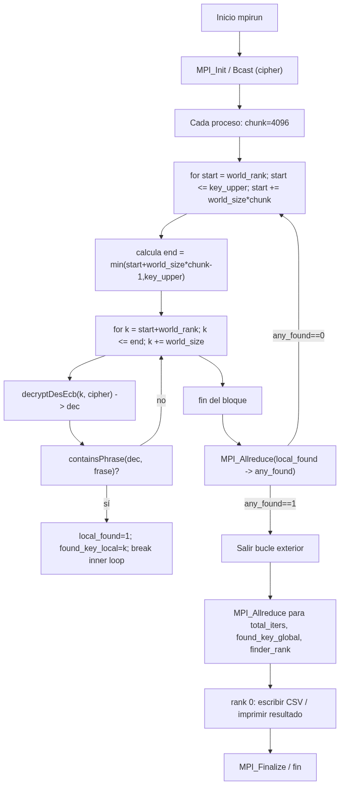

# Soluciones propuestas

## Enfoque 1 — Impl1

Se paraleliza la búsqueda por fuerza bruta usando un reparto *block-cyclic* por **turnos/chunks** es decir que cada proceso procesa, por turnos, bloques de `chunk` claves intercaladas con paso `P` dentro de ventanas de tamaño `chunk*P` y después de completar su bloque hace una reducción colectiva para comprobar si se debe detener. La exploración local se realiza mediante bucles for.

### Detalle de la estrategia

1. **Reparto de trabajo — block-cyclic por *chunk*.**

   - `const uint64_t chunk = 4096ULL;` (definición del tamaño de bloque).
   - El bucle externo salta por ventanas: `for (uint64_t start = (uint64_t)world_rank; start <= key_upper; start += world_size * chunk)` y calcula `end = start + world_size*chunk - 1` (ajustando con `key_upper`).
   - Dentro de la ventana, cada proceso prueba claves `k` con paso `world_size`: `for (uint64_t k = start + (uint64_t)world_rank; k <= end; k += (uint64_t)world_size)`.
   - Esto produce un reparto **intercalado por procesos dentro de bloques**: cada bloque tiene `world_size * chunk` claves, y dentro del bloque cada rank toma claves separadas por `world_size`.

2. **Bucle de prueba local (pure `for`) y rutinas usadas (líneas relevantes).**

   - Por cada `k` se hace:

     - `decryptDesEcb(k, cipher, cipher_len, &dec, &dec_len)` → descifrado que asigna `dec`.
     - `containsPhrase(dec, dec_len, frase)` → búsqueda de la frase (usa internamente `memcpy` + `strstr`).
     - Liberar `dec`.
   - Estas llamadas aparecen en el interior del `for` y son las que realizan el trabajo “pesado” por clave.

    Todo es **bucles `for`** la sincronización ocurre vía colecciones `MPI_Allreduce` tras cada bloque.

3. **Detección temprana y sincronización — `MPI_Allreduce` como mecanismo de parada.**

   - Tras completar cada bloque (la iteración del `for` externo), cada proceso hace:

     ```c
     int any_found = 0;
     MPI_Allreduce(&local_found, &any_found, 1, MPI_INT, MPI_MAX, MPI_COMM_WORLD);
     if (any_found) break;
     ```

     (esto comprueba si **cualquiera** encontró la frase y ordena a todos terminar).
   - Al final se consolidan métricas con `MPI_Allreduce`/`MPI_Allreduce`/`MPI_Allreduce` (iteraciones totales, clave mínima encontrada y rank ganador) y se usan esos resultados para registro e impresión.

   **Por qué `Allreduce`:** evita la necesidad de enviar mensajes punto a punto para notificar parada; es una operación colectiva con coste previsble y que devuelve el OR/MAX global de la bandera `found`.

4. **Líneas responsables:**

   - `chunk` y los bucles `start` / `k` (reparto block-cyclic): ver `impl1_par.c` — definición `const uint64_t chunk = 4096ULL;` y los bucles `for (uint64_t start = (uint64_t)world_rank; ...)` y `for (uint64_t k = start + (uint64_t)world_rank; k <= end; k += (uint64_t)world_size)` .
   - Descifrado y chequeo de frase: llamadas a `decryptDesEcb(...)` y `containsPhrase(...)` dentro del bucle interior.
   - Sincronización / parada temprana: `MPI_Allreduce(&local_found, &any_found, 1, MPI_INT, MPI_MAX, MPI_COMM_WORLD); if (any_found) break;`.
   - Consolidación final de métricas: `MPI_Allreduce(&local_iters, &total_iters, ...)` y `MPI_Allreduce(&found_key_local, &found_key_global, ...)` y reducción para `finder_rank`.

5. **Patrones de comunicación:**

   - **Broadcast inicial:** `MPI_Bcast` del `cipher`/tamaño en el path de `encrypt`/`decrypt` (para compartir el dato a todos).
   - **Colecciones (`MPI_Allreduce`)** tras cada bloque y al final para detectar parada y agregar métricas.
   - **No hay envíos punto-a-punto para parada** en `impl1_par` (p. ej. `MPI_Send`/`MPI_Irecv` no se usan aquí para notificar). Si comparas, `bruteforce.c` usa `MPI_Irecv` + `MPI_Send` para notificación directa.

### Ventajas y limitaciones del enfoque usado

- **Ventajas**

  - Balance: el block-cyclic por *chunk* amortigua desbalances y permite que cada proceso haga trabajo suficiente entre sincronizaciones.
  - Comunicación: `MPI_Allreduce` evita ráfagas de mensajes punto a punto cuando la detección temprana es poco frecuente.

- **Limitaciones**

  - Latencia de parada: la notificación de que otro proceso encontró la clave sólo se propaga en la siguiente `Allreduce` (fin de chunk), por lo que puede haber *overwork* (trabajo inútil) hasta que la reducción se haga efectiva.
  - Overhead de `Allreduce` si `chunk` es muy pequeño (sincronizaciones frecuentes) o si la comunicación es lenta.
  - Copias/desempeño por intento: cada intento realiza `decryptDesEcb` que asigna `dec` en heap y `containsPhrase` hace `memcpy` internamente; esto genera presión de memoria/GC y coste por clave. Posible optimización: buffer reutilizable y evitar malloc/free por intento.



## Enfoque 2 — Impl2

### 1. Modelo criptográfico

#### 1.1 DES en modo ECB (con OpenSSL)

- **Bloque**: 64 bits; **clave efectiva**: 56 bits.  
- **Modo**: ECB (*Electronic Code Book*): cada bloque se cifra de forma independiente.  
- **Padding**: convencionalmente múltiplos de 8 bytes (p. ej., PKCS#7).  
- **API (vía `core_crypto.h`)**:  

  ```c
  int encryptDesEcb(uint64_t key56,
                    const unsigned char *in, size_t len,
                    unsigned char **out, size_t *out_len);

  int decryptDesEcb(uint64_t key56,
                    const unsigned char *in, size_t len,
                    unsigned char **out, size_t *out_len);

  int containsPhrase(const unsigned char *buf, size_t len,
                     const char *phrase);
  ```

Retornan `0` si la operación fue correcta y asignan el búfer de salida.

#### 1.2 Detección de texto válido

- Se busca una **frase** dentro del texto plano descifrado:

  - `containsPhrase(dec, dec_len, phrase)` → `1` si la contiene, `0` en caso contrario.

### 2. Interfaz pública de Impl2 (`impl2.h`)

- **Contrato común**: el mismo que emplean Impl1/Impl3.
- **Memoria**: `out` es asignado internamente y el **llamador libera**.

### 3. Diseño secuencial (`impl2_seq.c`)

#### 3.1 Flujo “encrypt”

1. Lee **stdin** → `plain`.
2. Cifra con `key56` → `cipher`.
3. Escribe binario (`out_bin`) y **agrega una fila** al CSV (`data/impl2/sec.csv`).

#### 3.2 Flujo “decrypt/brute”

1. Carga **cifrado** (`in_bin`).
2. Inicia cronómetro (`nowMono()` / `diffMono`).
3. Recorre $k = 0..key_upper$:

   - Descifra → `dec`.
   - `containsPhrase(dec, dec_len, phrase)` → *found*.
   - Si encuentra: *break*.
4. Imprime en stdout (`found=…` / `no encontrado`).
5. Escribe fila en CSV:

   - `time_seconds` = tiempo total.
   - `iterations_done` = iteraciones ejecutadas.
   - `found` = 0/1.
   - `p` = valor pasado por CLI (para la tabla).

> La escritura en CSV usa utilidades de `common.h`/`core_utils.h`: `ensureHeader`, `isoUtcNow`, `csvSanitize`.

### 4. Diseño paralelo MPI (`impl2_par.c`)

#### 4.1 Roles y datos compartidos

- **Todos los procesos** participan de la búsqueda (no hay maestro dedicado).
- **Difusión inicial**:

  - `encrypt`: `rank 0` lee `stdin` y difunde `plain` → cifra → escribe `out_bin` + CSV.
  - `decrypt`: `rank 0` lee `in_bin` y **difunde** `cipher` (tamaño y contenido) a todos.

#### 4.2 Esquema de reparto (block-cyclic simple)

Se itera por turnos $t = 0, 1, 2, …$ y cada proceso $r$ toma claves intercaladas:

$$
\text{base}(t, r) = r \cdot c + t \cdot (c \cdot P)
$$

con **chunk** $c = 1$ y $P$ = número de procesos.

Rango local:

$$
[\text{base}, \min(\text{base} + c - 1, key_upper)]
$$

> Este patrón reparte uniformemente las claves y **reduce zonas calientes**; con $c>1$ (extensión futura) se amortizan latencias.

#### 4.3 Parada temprana no bloqueante

- Cualquier proceso que detecta la **frase**:

  1. Marca `found=1`, `found_key=k`, `winner_rank=r`.
  2. Envía **no bloqueante** `TAG_FOUND` con la clave a todos.
- Todos los procesos sondean con `MPI_Iprobe(TAG_FOUND)` antes/durante el lazo:

  - Si llega `TAG_FOUND`, recuperan la clave ganadora y salen.

#### 4.4 Consolidación de métricas

- `MPI_Reduce`:

  - **Tiempo**: `MAX` de los locales → `max_time`.
  - **Iteraciones**: `SUM` → `total_iters`.
  - **Found**: `MAX` (0/1) → `found_any`.
  - **Winner_rank**: `MAX` (o -1) → `global_winner`.
- `rank 0` imprime resumen y escribe la fila única al CSV `data/impl2/par.csv`.

### 5. Complejidad y modelo de desempeño

#### 5.1 Complejidad básica

- **Secuencial**:

$$
T_s \approx \sum_{k=0}^{key_upper} (t_{dec}(k) + t_{chk}(k))
$$

(hasta encontrar o agotar).

- **Paralelo** (idealmente):

$$
T_p \approx \frac{T_s}{P}
$$

pero en la práctica se ve afectado por:

- **Desequilibrio** (hallazgo temprano/tardío).
- **Overheads** de comunicación (`Bcast`, `Iprobe/Isend`, `Reduce`).
- **I/O CSV** centralizado en `rank 0`.

#### 5.2 *Speedup* y eficiencia

$$
S = \frac{T_s}{T_p}, \qquad E = \frac{S}{P}
$$

- **Amdahl** (fracción secuencial $f$):

$$
S_{\max} = \frac{1}{f + \frac{(1-f)}{P}}
$$

- **Gustafson** (escala con $P$):

$$
S_G \approx P - f \cdot (P - 1)
$$

> La parada temprana introduce **variabilidad**: cuando la clave está cerca del inicio, el *speedup* observado puede ser menor; si está cerca del final, la paralelización luce mejor.

### 6. Validación de correctitud

1. **Cifrado/Descifrado**: con `-DUSE_OPENSSL` debe recuperarse el `cipher` con la misma clave.
2. **Búsqueda**: la clave reportada (`found_key`) debe descifrar un texto que **contenga la frase**.
3. **CSV**: cada ejecución agrega **una fila** con campos consistentes (`timestamp`, `hostname`, `p`, `iterations_done`, etc.).

### 7. Parámetros prácticos y recomendaciones

- **chunk (c)**: esta versión usa $c = 1$.
- **Entrada/salida**:

  - Ejecutar en **WSL dentro de `$HOME`**.
  - No usar `root` con `mpirun`.
  - Garantizar existencia de `data/impl2/` y encabezado único.
- **Repeticiones**: ejecutar ≥3 veces por combinación (`key_upper`, `p`).

### 8. Limitaciones conocidas

- **ECB** filtra patrones (solo con fines didácticos).
- **I/O centralizado** en `rank 0` puede ser cuello de botella.
- **Detección por frase** es un *oracle* simple.

### 9. Posibles mejoras

- **Balanceo dinámico** (*work-stealing*).
- **Comunicación colectiva** (`MPI_Allreduce`).
- **I/O asíncrono** (buffering).
- **Lotes de claves** ($c > 1$).
- **Vectorización** (SIMD) del descifrado.

### 10. Conclusiones

- **Impl2 altA** implementa un patrón **MPI sin maestro** con **parada temprana no bloqueante**.
- La **variabilidad** del punto de hallazgo domina el *speedup*; conviene promediar resultados.
- Con *chunks* mayores y menos sincronización, el **escalamiento** mejora para grandes espacios de claves.

## Enfoque 3 — Impl3

La **Implementación 3** del proyecto utiliza un enfoque **Master–Worker** para distribuir dinámicamente el espacio de búsqueda durante un ataque de fuerza bruta basado en MPI. Este enfoque surge como respuesta directa a las limitaciones detectadas en el **acercamiento naive** (impl1), donde la división del rango de llaves en bloques contiguos genera **alta varianza en los tiempos de ejecución** dependiendo de la posición en la que se encuentre la llave correcta.

### Problema con el enfoque naive

- Si la llave se encuentra **muy temprano** en el rango de uno de los procesos → **speedup artificialmente enorme**
- Si la llave aparece **muy tarde** en el primer proceso → speedup ≈ 1 (sin mejora paralela)
- Los procesos pueden **quedar ociosos** mientras otros trabajan
- La métrica de performance queda **sesgada por azar**, no por diseño del algoritmo

Este comportamiento es **inconsistente**, difícil de analizar y poco confiable para medir paralelismo real.

### Solución: Distribución dinámica de trabajo

El enfoque Master–Worker introduce:

- **Asignación de chunks de llaves bajo demanda**
- **Trabajo balanceado entre todos los procesos activos**
- **Detención temprana global** cuando algún worker encuentra la llave
- **Speedups más consistentes y reproducibles**

#### Flujo resumido

| Rol                     | Tareas principales                                                                   |
| ----------------------- | ------------------------------------------------------------------------------------ |
| **Master (rank 0)**     | Administra el puntero global de trabajo (`next_chunk`) y envía trabajo a los workers |
| **Workers (ranks > 0)** | Solicitan chunks, prueban llaves y notifican éxito                                   |

Todos los procesos permanecen **ocupados** hasta que **alguien encuentra la llave** ✅

### Conceptos clave del modelo

| Concepto                       | Beneficio                                    |
| ------------------------------ | -------------------------------------------- |
| **Chunking**                   | Minimiza overhead de comunicación            |
| **Work-Stealing implícito**    | Workers que acaban antes reciben más trabajo |
| **Detección temprana**         | Evita buscar llaves después de éxito         |
| **Distribución más homogénea** | Speedup más estable y cercano al ideal       |

La eficiencia depende del tamaño del **chunk**:

- Muy pequeño → exceso de mensajes MPI
- Muy grande → pérdida temporal de balance
- Se ajusta empíricamente según pruebas

### Impacto en speedup y performance

- La **variancia del tiempo** se reduce de manera significativa
- Los resultados se vuelven **más representativos del paralelismo** real
- El algoritmo ya no depende del **azar** (posición de la llave)

La Implementación 3 tiende a obtener:

S ≈ T_seq / T_par → N − ε

donde `N` es el número de procesos y `ε` es el costo de comunicación.

### Ventajas y desventajas

| Ventajas                   |  Desventajas                        |
| -------------------------- | ----------------------------------- |
| Excelente balance de carga | Overhead de mensajes MPI            |
| Speedup más estable        | Maestro puede ser cuello de botella |
| Paro temprano global       | Tamaño del chunk debe calibrarse    |
| Apto para clusters reales  | Código más complejo                 |

### Justificación teórica

Este modelo es ampliamente utilizado en:

- Aplicaciones HPC de **exploración de espacio de búsqueda**
- **Brute-force cryptanalysis** como este proyecto
- Render distribuido, simulaciones Monte-Carlo, etc.

La técnica es reconocida como una mejora **práctica y teórica** ante el reparto contiguo de trabajo.

### Conclusión de investigación

La implementación Master–Worker **maximiza el grado de paralelismo efectivo**, mitigando la aleatoriedad del naive y permitiendo una **evaluación consistente y objetiva del speedup**.
Este acercamiento representa un diseño **más escalable, más justo entre procesos**, y orientado al rendimiento en entornos distribuidos como MPI.
