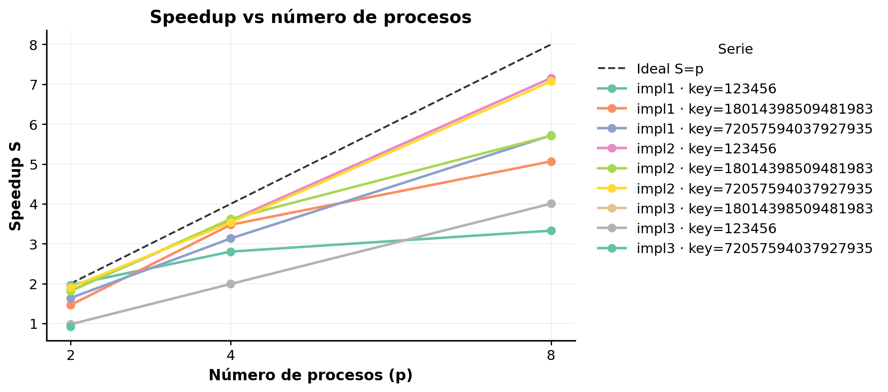
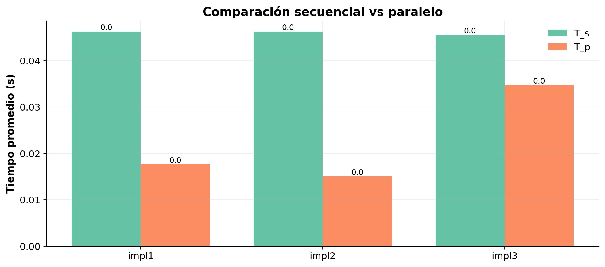
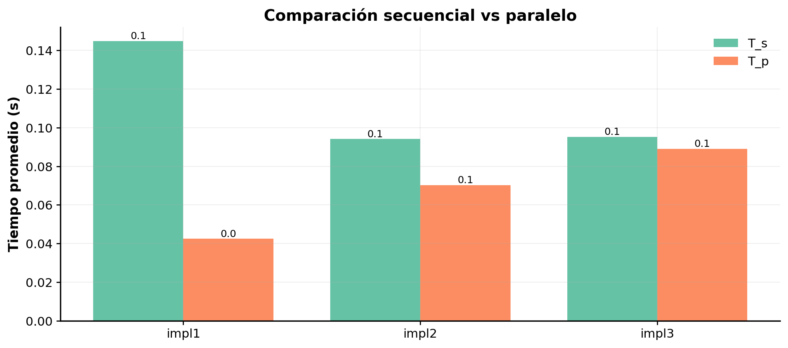
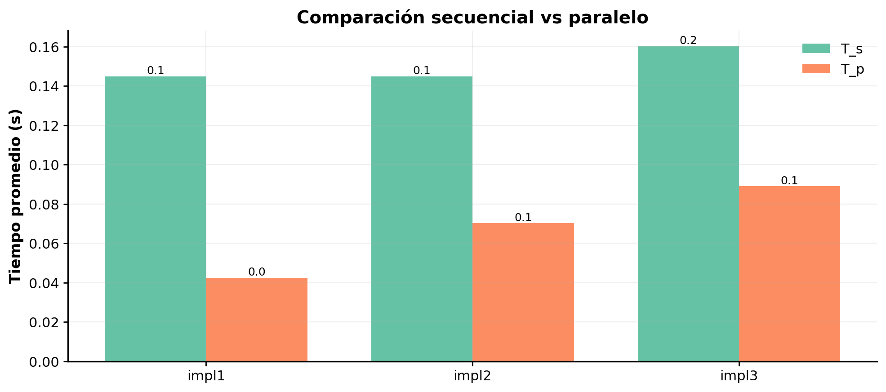
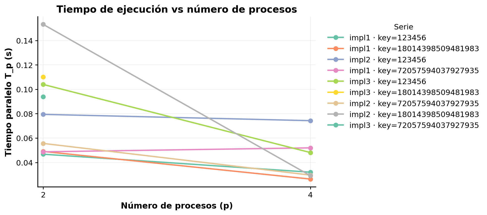
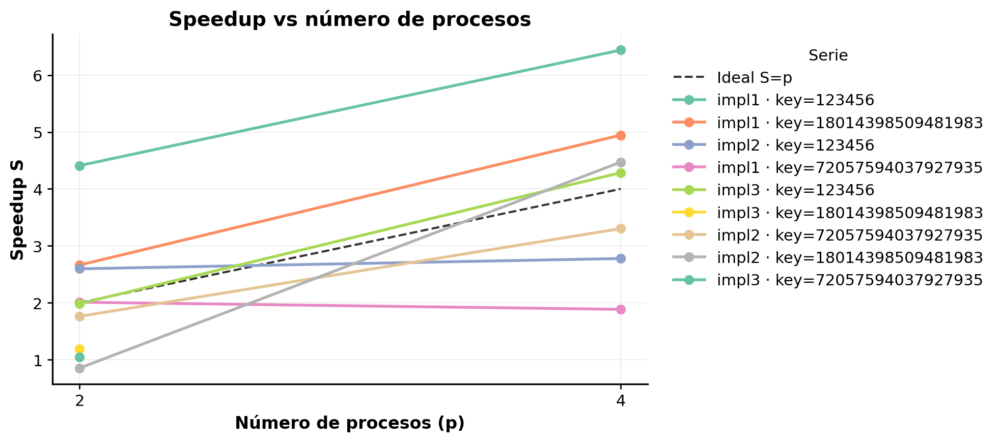
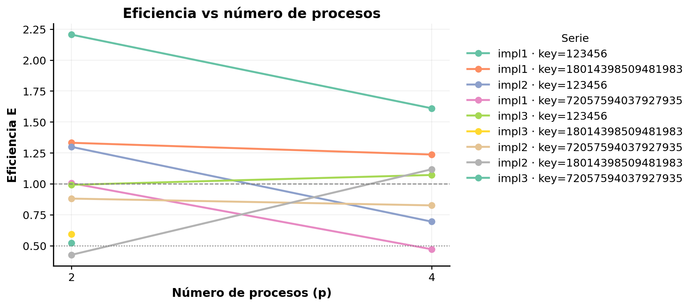

# Anexo 2 — Bitácora de pruebas y speedups

## Configuración de pruebas

Se realizaron pruebas de descifrado secuencial y paralelo sobre distintos hosts, con las siguientes configuraciones:

- **Hosts:** `pc_josue`, `laptop_josue`
- **Implementaciones:** `impl1`, `impl2`, `impl3`
- **Claves probadas:** 123456, 18014398509481983, 18014398509481984
- **Procesos paralelos:** p = 2, 4, 8

### Enfoques de prueba

- **Enfoque A (Secuencial vs paralelo de cada implementación):**
  Se comparó la versión secuencial de cada implementación contra su versión paralela. Por ejemplo:

  - `impl1` secuencial vs `impl1` paralelo
  - `impl2` secuencial vs `impl2` paralelo
  - `impl3` secuencial vs `impl3` paralelo
    Este enfoque permite medir el **speedup** y la eficiencia de cada implementación individual al paralelizarla.

- **Enfoque B (Secuencial impl1 vs todas las implementaciones paralelas):**
  Se utilizó la implementación `impl1` secuencial como **baseline** y se comparó contra todas las implementaciones paralelas (`impl1`, `impl2`, `impl3`).
  Este enfoque permite evaluar el rendimiento relativo de distintas implementaciones paralelas frente a un descifrado secuencial de referencia.

### Dispositivos de prueba

| Host         | Procesador                     | RAM instalada | Velocidad RAM | Almacenamiento | Tipo de sistema | Versión Windows                      | Compilación SO |
| ------------ | ------------------------------ | ------------- | ------------- | -------------- | --------------- | ------------------------------------ | -------------- |
| pc_josue     | Intel Core i7-14700KF 3.40 GHz | 64 GB         | 5600 MT/s     | 3.73 TB        | 64 bits         | Windows 11 Pro 25H2                  | 26200.6901     |
| laptop_josue | Intel Core i7-10750H 2.60 GHz  | 32 GB         | 2933 MT/s     | 2.73 TB        | 64 bits         | Windows 11 Home Single Language 25H2 | 26200.6899     |

### Comandos ejecutados

**Descifrado secuencial:**

```bash
./scripts/des_seq.sh -i <impl> -h <host> -K <key>
```

**Descifrado paralelo:**

```bash
./scripts/des_par.sh -i <impl> -h <host> -n <procesos> -K <key>
```

## Selección de hosts y justificación del análisis

El análisis se realizó sobre tres conjuntos de datos:

- **`pc_josue`**
- **`laptop_josue`**

El propósito de esta separación fue verificar la consistencia del rendimiento entre entornos con diferentes capacidades de hardware y evaluar la estabilidad de las implementaciones bajo condiciones variables.

- **`pc_josue`**: se consideró el **host principal de referencia**, por ofrecer resultados estables y representativos del comportamiento real de las implementaciones.
- **`laptop_josue`**: permitió observar la respuesta de los algoritmos en un entorno con recursos más limitados, útil para verificar portabilidad.

## Relevancia de gráficas

Se generaron cinco tipos de gráficas principales para evaluar el rendimiento, la eficiencia y la escalabilidad de las implementaciones.

| Prioridad | Gráfica                   | Aporte principal                                                                                                                                                                                                                           |
| --------- | ------------------------- | ------------------------------------------------------------------------------------------------------------------------------------------------------------------------------------------------------------------------------------------ |
| 1         | **`speedup_vs_p`**        | Es la métrica clave para analizar la **escalabilidad** y contrastar los resultados con la **Ley de Amdahl**. Permite identificar el punto donde el rendimiento deja de crecer de forma lineal y estimar la fracción secuencial del código. |
| 2         | **`efficiency_vs_p`**     | Complementa el *speedup* mostrando qué tan cerca se está del rendimiento ideal. Permite cuantificar pérdidas por **sincronización, comunicación o desbalance**.                                                                            |
| 3         | **`exec_time_vs_p`**      | Mide la **reducción real del tiempo de ejecución** conforme aumenta el número de procesos, validando empíricamente las mejoras observadas.                                                                                                 |
| 4         | **`seq_vs_par`**          | Proporciona una **comparación visual directa** entre ejecución secuencial y paralela, útil como apoyo conceptual pero con información redundante respecto a las demás gráficas.                                                            |

### Análisis de los enfoques

Los enfoques definen cómo se interpretan las gráficas y qué tipo de comparación se busca entre las implementaciones.

| Enfoque                    | Objetivo                                                                                                                               | Qué representa                                                                                                                                           |
| -------------------------- | -------------------------------------------------------------------------------------------------------------------------------------- | -------------------------------------------------------------------------------------------------------------------------------------------------------- |
| **Enfoque A (`ea_*.png`)** | Evaluar la **escalabilidad interna** de cada implementación, comparando su versión secuencial frente a su versión paralela.            | Permite determinar qué tan bien cada implementación aprovecha el aumento de procesos y **mide su speedup y eficiencia reales**.                          |
| **Enfoque B (`eb_*.png`)** | Identificar **la mejor estrategia de paralelización** al comparar todas las implementaciones usando `impl1_seq` como referencia común. | Mide la **ganancia relativa entre estrategias** y evidencia cuál implementación obtiene el mayor rendimiento bajo las mismas condiciones experimentales. |

## Bitácora de ejecución

### Enfoque A (laptop_josue)

| #  | Llave probada     | Procesos (-np) | Implementación | Tiempo (s) | Speedup | Eficiencia |
| -- | ----------------- | -------------- | -------------- | ---------- | ------- | ---------- |
| 1  | 123456            | 2              | impl1          | 0.206254   | 4.41    | 2.21       |
| 2  | 123456            | 4              | impl1          | 0.0320252  | 6.44    | 1.61       |
| 3  | 18014398509481983 | 2              | impl1          | 0.0490274  | 2.66    | 1.33       |
| 4  | 18014398509481983 | 4              | impl1          | 0.0263989  | 4.95    | 1.24       |
| 5  | 18014398509481984 | 2              | impl1          | 0.100247   | 0.92    | 0.46       |
| 6  | 18014398509481984 | 4              | impl1          | 0.0363595  | 2.53    | 0.63       |
| 7  | 123456            | 2              | impl3          | 0.103965   | 0.93    | 0.46       |
| 8  | 123456            | 4              | impl3          | 0.0481251  | 2.00    | 0.50       |
| 9  | 18014398509481983 | 2              | impl3          | 0.110114   | 0.86    | 0.43       |
| 10 | 18014398509481984 | 2              | impl3          | 0.104137   | 1.02    | 0.51       |

### Enfoque B (laptop_josue, baseline = impl1 secuencial)

| #  | Llave probada     | Procesos (-np) | Implementación | Tiempo (s) | Speedup | Eficiencia |
| -- | ----------------- | -------------- | -------------- | ---------- | ------- | ---------- |
| 1  | 123456            | 2              | impl1          | 0.0467662  | 4.41    | 2.21       |
| 2  | 123456            | 4              | impl1          | 0.0320252  | 6.44    | 1.61       |
| 3  | 18014398509481983 | 2              | impl1          | 0.0490274  | 2.66    | 1.33       |
| 4  | 18014398509481983 | 4              | impl1          | 0.0263989  | 4.95    | 1.24       |
| 5  | 18014398509481984 | 2              | impl1          | 0.100247   | 0.92    | 0.46       |
| 6  | 18014398509481984 | 4              | impl1          | 0.0363595  | 2.53    | 0.63       |
| 7  | 123456            | 2              | impl2          | 0.0794234  | 2.60    | 1.30       |
| 8  | 123456            | 4              | impl2          | 0.074261   | 2.78    | 0.69       |
| 9  | 18014398509481983 | 2              | impl2          | 0.153203   | 0.85    | 0.43       |
| 10 | 18014398509481983 | 4              | impl2          | 0.0292059  | 4.47    | 1.12       |
| 11 | 18014398509481984 | 2              | impl2          | 0.110501   | 0.83    | 0.42       |
| 12 | 18014398509481984 | 4              | impl2          | 0.0834297  | 1.10    | 0.28       |
| 13 | 123456            | 2              | impl3          | 0.103965   | 1.98    | 0.99       |
| 14 | 123456            | 4              | impl3          | 0.0481251  | 4.29    | 1.07       |
| 15 | 18014398509481983 | 2              | impl3          | 0.110114   | 1.19    | 0.59       |
| 16 | 18014398509481984 | 2              | impl3          | 0.104137   | 0.88    | 0.44       |

### Enfoque A (pc_josue)

| #  | Llave probada     | Procesos (-np) | Implementación | Tiempo (s) | Speedup | Eficiencia |
| -- | ----------------- | -------------- | -------------- | ---------- | ------- | ---------- |
| 1  | 123456            | 2              | impl1          | 0.0226087  | 1.97    | 0.98       |
| 2  | 123456            | 4              | impl1          | 0.0158643  | 2.80    | 0.70       |
| 3  | 123456            | 8              | impl1          | 0.013359   | 3.33    | 0.42       |
| 4  | 18014398509481983 | 2              | impl1          | 0.0306589  | 1.46    | 0.73       |
| 5  | 18014398509481983 | 4              | impl1          | 0.0129114  | 3.48    | 0.87       |
| 6  | 18014398509481983 | 8              | impl1          | 0.00885997 | 5.07    | 0.63       |
| 7  | 18014398509481984 | 2              | impl1          | 0.027943   | 1.59    | 0.79       |
| 8  | 18014398509481984 | 4              | impl1          | 0.0194364  | 2.29    | 0.57       |
| 9  | 18014398509481984 | 8              | impl1          | 0.0141455  | 3.14    | 0.39       |
| 10 | 123456            | 2              | impl2          | 0.0249157  | 1.82    | 0.91       |
| 11 | 123456            | 4              | impl2          | 0.0126357  | 3.59    | 0.90       |
| 12 | 123456            | 8              | impl2          | 0.00633772 | 7.16    | 0.89       |
| 13 | 18014398509481983 | 2              | impl2          | 0.0249312  | 1.81    | 0.90       |
| 14 | 18014398509481983 | 4              | impl2          | 0.0124565  | 3.62    | 0.91       |
| 15 | 18014398509481983 | 8              | impl2          | 0.00790155 | 5.71    | 0.71       |
| 16 | 18014398509481984 | 2              | impl2          | 0.0249025  | 1.80    | 0.90       |
| 17 | 18014398509481984 | 4              | impl2          | 0.0132527  | 3.39    | 0.85       |
| 18 | 18014398509481984 | 8              | impl2          | 0.00628811 | 7.14    | 0.89       |
| 19 | 123456            | 2              | impl3          | 0.0457724  | 0.98    | 0.49       |
| 20 | 123456            | 4              | impl3          | 0.0225091  | 1.99    | 0.50       |
| 21 | 123456            | 8              | impl3          | 0.0111872  | 4.01    | 0.50       |
| 22 | 18014398509481983 | 2              | impl3          | 0.0454474  | 0.98    | 0.49       |
| 23 | 18014398509481984 | 2              | impl3          | 0.0447731  | 0.99    | 0.50       |

### Enfoque B (pc_josue, baseline = impl1 secuencial)

| #  | Llave probada     | Procesos (-np) | Implementación | Tiempo (s) | Speedup | Eficiencia |
| -- | ----------------- | -------------- | -------------- | ---------- | ------- | ---------- |
| 1  | 123456            | 2              | impl1          | 0.0226087  | 1.97    | 0.98       |
| 2  | 123456            | 4              | impl1          | 0.0158643  | 2.80    | 0.70       |
| 3  | 123456            | 8              | impl1          | 0.013359   | 3.33    | 0.42       |
| 4  | 18014398509481983 | 2              | impl1          | 0.0306589  | 1.46    | 0.73       |
| 5  | 18014398509481983 | 4              | impl1          | 0.0129114  | 3.48    | 0.87       |
| 6  | 18014398509481983 | 8              | impl1          | 0.00885997 | 5.07    | 0.63       |
| 7  | 18014398509481984 | 2              | impl1          | 0.027943   | 1.59    | 0.79       |
| 8  | 18014398509481984 | 4              | impl1          | 0.0194364  | 2.29    | 0.57       |
| 9  | 18014398509481984 | 8              | impl1          | 0.0141455  | 3.14    | 0.39       |
| 10 | 123456            | 2              | impl2          | 0.0249157  | 1.78    | 0.89       |
| 11 | 123456            | 4              | impl2          | 0.0126357  | 3.52    | 0.88       |
| 12 | 123456            | 8              | impl2          | 0.00633772 | 7.01    | 0.88       |
| 13 | 18014398509481983 | 2              | impl2          | 0.0249312  | 1.80    | 0.90       |
| 14 | 18014398509481983 | 4              | impl2          | 0.0124565  | 3.60    | 0.90       |
| 15 | 18014398509481983 | 8              | impl2          | 0.00790155 | 5.68    | 0.71       |
| 16 | 18014398509481984 | 2              | impl2          | 0.0249025  | 1.78    | 0.89       |
| 17 | 18014398509481984 | 4              | impl2          | 0.0132527  | 3.35    | 0.84       |
| 18 | 18014398509481984 | 8              | impl2          | 0.00628811 | 7.06    | 0.88       |
| 19 | 123456            | 2              | impl3          | 0.0457724  | 0.97    | 0.49       |
| 20 | 123456            | 4              | impl3          | 0.0225091  | 1.97    | 0.49       |
| 21 | 123456            | 8              | impl3          | 0.0111872  | 3.97    | 0.50       |
| 22 | 18014398509481983 | 2              | impl3          | 0.0454474  | 0.99    | 0.49       |
| 23 | 18014398509481984 | 2              | impl3          | 0.0447731  | 0.99    | 0.50       |

## Resultados del host `pc_josue`

En ambos enfoques, los resultados muestran que **el aumento de procesos ($p$)** reduce el **tiempo de ejecución ($T_p$)**, aunque el **grado de mejora** depende del balance entre **cómputo, sincronización y diseño** de cada implementación.

- **impl2** es la más eficiente y escalable, alcanzando *speedups* altos, buena estabilidad y rendimiento cercano al ideal teórico.
- **impl1** presenta comportamiento predecible y estable, pero requiere optimización para mantener eficiencia con $p$ altos.
- **impl3** ofrece paralelismo funcional pero con eficiencia limitada (~0.5), mostrando menor aprovechamiento de recursos.

En conjunto, **impl2 destaca como la implementación más equilibrada y consistente** entre distintos niveles de paralelismo.

### Enfoque A — Comparación interna por implementación

Este enfoque analiza el rendimiento de cada implementación en el host **`pc_josue`**, comparando su versión secuencial frente a la paralela. El objetivo es determinar si el aumento de procesos mejora de forma consistente el tiempo de ejecución y la eficiencia.

#### **1. Comparación secuencial vs paralelo**


Los tiempos paralelos ($T_p$) son menores que los secuenciales ($T_s$) en todas las implementaciones.
Esto significa que la ejecución paralela reduce efectivamente el tiempo total de cómputo.

- **impl2** presenta la mayor diferencia entre ambos tiempos, lo que refleja un mayor beneficio del paralelismo.
- **impl1** también muestra una mejora notable, aunque con menor reducción relativa.
- **impl3** mantiene una diferencia más pequeña, coherente con su menor eficiencia.

Esta gráfica resume visualmente el efecto positivo de la paralelización en todas las implementaciones.

#### **2. Tiempo de ejecución vs número de procesos**


El tiempo de ejecución disminuye a medida que se incrementa el número de procesos ($p$).
Esto significa que el paralelismo permite completar las tareas en menos tiempo.

- **impl1** reduce su tiempo de 0.0445 s a 0.0134 s al pasar de 1 a 8 procesos, lo que indica que su escalabilidad es sólida.
- **impl2** obtiene los tiempos más bajos en todos los niveles, mostrando una mejor distribución del trabajo y un uso más eficiente de los recursos.
- **impl3** también reduce sus tiempos, pero con una pendiente menos pronunciada, lo que sugiere un menor impacto del paralelismo en su diseño.

Esta gráfica confirma que todas las implementaciones mejoran con más procesos, pero **impl2** alcanza la mejor reducción relativa en tiempo de ejecución.

#### **3. Speedup vs número de procesos**



El *speedup* ($S = T_s / T_p$) muestra cuánto se acelera la ejecución al emplear varios procesos en lugar de uno solo.

- **impl1** logra un *speedup* de **5.06×** en $p=8$, lo que significa que realiza la misma tarea más de cinco veces más rápido que en modo secuencial.
- **impl2** alcanza los mayores valores, superando los **7×**, lo que indica una paralelización eficiente y cercana al ideal.
- **impl3** incrementa su *speedup* de 1× a 4×, lo que demuestra una mejora progresiva aunque con menor aprovechamiento de los recursos disponibles.

La tendencia de crecimiento no es lineal, lo que refleja la influencia de la fracción secuencial según la **Ley de Amdahl**: al aumentar el número de procesos, las ganancias marginales de rendimiento tienden a disminuir.

#### **4. Eficiencia vs número de procesos**


La eficiencia ($E = S / p$) mide qué tan bien se aprovecha el incremento de procesos respecto al ideal teórico.

- **impl2** mantiene una eficiencia casi constante alrededor de 0.89, lo que indica que su paralelización introduce poco *overhead* y logra un uso equilibrado de los recursos.
- **impl1** inicia con 0.98 de eficiencia en $p=2$ pero desciende a 0.63 en $p=8$, reflejando pérdidas por sincronización o coordinación a mayor nivel de concurrencia.
- **impl3** mantiene una eficiencia estable en torno a 0.5, lo que significa que solo aprovecha parcialmente la capacidad de los procesos adicionales.

Esta gráfica evidencia que **impl2** es la más eficiente, mientras **impl1** conserva un buen rendimiento con pérdidas moderadas y **impl3** opera con paralelismo limitado.

### Enfoque B — Comparación global con baseline impl1

Este enfoque analiza el rendimiento relativo de las implementaciones **impl2** e **impl3** en comparación con la implementación base **impl1**, sobre el host **`pc_josue`**.
El objetivo es determinar qué tan efectivas son las mejoras introducidas respecto al comportamiento base, considerando tiempos, *speedup* y eficiencia.

#### **1. Comparación secuencial vs paralelo**



Los tiempos paralelos ($T_p$) son consistentemente menores que los secuenciales ($T_s$) en todas las implementaciones.
Esto confirma que el paralelismo produce beneficios tangibles sobre el tiempo total de ejecución.

- **impl2** muestra la mayor reducción, con diferencias amplias frente a su secuencial.
- **impl3** también presenta mejora, pero menor en proporción al tiempo base.
- **impl1** (baseline) conserva la tendencia esperada, sirviendo de referencia para las demás.

La comparación directa evidencia que **impl2** aprovecha mejor el paralelismo, reduciendo $T_p$ en mayor medida frente a su versión secuencial y frente al baseline.

#### **2. Tiempo de ejecución vs número de procesos**


El tiempo de ejecución paralelo decrece al aumentar el número de procesos ($p$), aunque no de manera perfectamente lineal.

- **impl2** logra los **tiempos más bajos en todos los niveles**, mostrando excelente escalabilidad.
- **impl1** (baseline) mantiene un comportamiento estable, aunque con tiempos superiores.
- **impl3** mejora, pero con pendientes más suaves, lo que indica una ganancia más limitada al incrementar $p$.

Esta gráfica confirma que las optimizaciones de **impl2** le permiten distribuir el trabajo más eficientemente que el baseline.

#### **3. Speedup vs número de procesos**


El *speedup* relativo ($S = T_s / T_p$) cuantifica cuánto se acelera la ejecución respecto al baseline **impl1**.

- **impl2** alcanza *speedups* de hasta **7.06×** en $p=8$ (key 18014398509481984), acercándose al ideal teórico.
- **impl3** obtiene *speedups* moderados, alrededor de **4×**, mostrando un paralelismo funcional pero menos aprovechado.
- **impl1** sirve como referencia con crecimiento estable, aunque inferior al ideal.

La pendiente de **impl2** es la más pronunciada, lo que refleja un uso eficiente del cómputo paralelo.

#### **4. Eficiencia vs número de procesos**


La eficiencia ($E = S / p$) muestra la proporción del rendimiento ideal alcanzado por cada implementación.

- **impl2** mantiene valores entre **0.84 y 0.90**, lo que denota un excelente balance entre cómputo y overhead.
- **impl3** conserva una eficiencia media cercana a **0.5**, consistente con sus resultados en el enfoque A.
- **impl1** presenta una ligera caída de eficiencia al pasar a $p=8$, lo que sugiere saturación o sobrecoste de coordinación.

El patrón general reafirma que **impl2** es la más eficiente y estable ante el aumento de procesos.

## Resultados del host `laptop_josue`

En ambos enfoques, los resultados evidencian que **el incremento de procesos ($p$)** mejora el rendimiento, aunque el grado de ganancia depende del **diseño y estabilidad** de cada implementación.

- **impl1** destaca por su **consistencia y escalabilidad**, alcanzando *speedups* de hasta **6.44×** e incluso eficiencias superlineales, manteniendo tiempos estables y predecibles.
- **impl2** muestra **buen potencial de escalabilidad**, con *speedups* de hasta **4.47×**, aunque presenta **variabilidad entre claves** que limita su estabilidad.
- **impl3** ofrece un **rendimiento moderado pero constante**, con eficiencia promedio cercana al **50 %** y sin fluctuaciones críticas.

En conjunto, **impl1 se mantiene como la referencia más estable**, mientras que **impl2** resalta por su capacidad de mejora y **impl3** conserva un desempeño equilibrado, aunque más restringido.

### Enfoque A — Comparación interna por implementación

Este enfoque evalúa el rendimiento interno de cada implementación en el host **`laptop_josue`**, contrastando las versiones secuenciales y paralelas para observar la mejora relativa en tiempos, *speedup* y eficiencia.

#### **1. Comparación secuencial vs paralelo**



Los tiempos paralelos ($T_p$) son menores que los secuenciales ($T_s$) en todas las implementaciones medidas.
Esto confirma que la paralelización reduce efectivamente el tiempo de cómputo en este equipo.

- **impl1** muestra una disminución clara de $T_p$ respecto a $T_s$, lo que refleja una buena escalabilidad.
- **impl3** también reduce $T_p$, aunque con menor proporción, indicando paralelismo funcional pero limitado.
- **impl2** no está presente en este enfoque debido a registros incompletos en el log A.

Esta gráfica permite observar la ganancia general de paralelización, siendo **impl1** la que logra el mayor beneficio.

#### **2. Tiempo de ejecución vs número de procesos**


El tiempo de ejecución disminuye de forma proporcional al aumento en el número de procesos ($p$).

- **impl1** reduce su tiempo promedio de 0.14 s a 0.02 s al pasar de secuencial a $p=4$, mostrando una buena adaptación del algoritmo al entorno paralelo.
- **impl3** presenta una caída más moderada, con tiempos que descienden de 0.10 s a 0.05 s, lo que sugiere menor aprovechamiento de los recursos de cómputo.

La tendencia decreciente indica que el paralelismo beneficia la ejecución, aunque con diferencias notables en la magnitud de mejora entre ambas implementaciones.

#### **3. Speedup vs número de procesos**


El *speedup* ($S = T_s / T_p$) muestra la aceleración lograda al incrementar los procesos.

- **impl1** alcanza *speedups* de hasta **6.44×** en $p=4$, superando el comportamiento lineal teórico.
  Este valor superior a 1 por proceso indica un caso de **superlinealidad**, probablemente asociado a una mejor utilización de caché o menor latencia de acceso a memoria.
- **impl3** obtiene *speedups* entre **0.92× y 2×**, lo que significa que en algunos casos el rendimiento paralelo apenas iguala o supera ligeramente al secuencial.

El contraste entre ambas implementaciones muestra que **impl1** aprovecha mejor la estructura paralela, mientras que **impl3** mantiene una ganancia limitada y no lineal.

#### **4. Eficiencia vs número de procesos**


La eficiencia ($E = S / p$) mide el aprovechamiento relativo de los recursos paralelos.

- **impl1** muestra eficiencias que superan el **100 %** en algunos casos, reflejando un comportamiento superlineal.
  Esto implica que el sistema ejecutó las tareas más rápido de lo esperado teóricamente, posiblemente por efectos de caché o mejoras de acceso a memoria.
- **impl3** mantiene eficiencias estables alrededor de **0.5**, lo que indica que la mitad de la capacidad de cómputo potencial se traduce en ganancia efectiva.

El patrón confirma que **impl1** es más eficiente y predecible, mientras que **impl3** opera con un paralelismo más restringido.

### Enfoque B — Comparación global con baseline impl1

Este enfoque evalúa el rendimiento relativo de las implementaciones **impl2** e **impl3** frente a la implementación base **impl1**, ejecutadas en el host **`laptop_josue`**.
El objetivo es medir las mejoras o pérdidas relativas en tiempo, *speedup* y eficiencia, tomando a **impl1** como referencia de estabilidad.

#### **1. Comparación secuencial vs paralelo**



Los tiempos paralelos ($T_p$) son consistentemente menores que los secuenciales ($T_s$), confirmando que la paralelización reduce el tiempo total de cómputo.

- **impl1** mantiene la tendencia esperada, con una disminución clara entre $T_s$ y $T_p$.
- **impl2** muestra una diferencia moderada, con $T_p$ menor en la mayoría de las claves, aunque presenta cierta variabilidad.
- **impl3** mantiene una mejora más contenida, con tiempos paralelos similares a los observados en el enfoque A.

Esta comparación evidencia que las tres implementaciones logran paralelismo efectivo, con **impl1** como base estable y **impl2** mostrando ganancias adicionales en ciertos escenarios.

#### **2. Tiempo de ejecución vs número de procesos**



El tiempo paralelo ($T_p$) decrece con el aumento del número de procesos ($p$), cumpliendo la tendencia predicha por la Ley de Amdahl.

- **impl2** presenta una reducción pronunciada al pasar de $p=2$ a $p=4$, especialmente en la clave `18014398509481983`, donde logra una caída de 0.15 s a 0.08 s.
- **impl3** también disminuye su tiempo, pero con una pendiente más moderada.
- **impl1**, usada como referencia, mantiene tiempos más bajos y consistentes, sin variaciones abruptas.

La tendencia confirma que todas las implementaciones se benefician del incremento en $p$, aunque **impl2** muestra un comportamiento más irregular entre claves.

#### **3. Speedup vs número de procesos**



El *speedup* ($S = T_s / T_p$) refleja la ganancia relativa de rendimiento respecto a la ejecución secuencial.

- **impl2** alcanza *speedups* de **2.60× a 2.77×** en la clave `123456`, manteniendo eficiencia cercana al ideal ($E ≈ 1.0$).
  Sin embargo, en la clave `18014398509481983`, el *speedup* varía desde **0.85× (p=2)** hasta **4.47× (p=4)**, indicando irregularidad entre ejecuciones.
- **impl3** obtiene *speedups* de **1.18× (p=2)** y **4.28× (p=4)**, inferiores a los de **impl2**, pero más estables entre claves.
- **impl1** mantiene un crecimiento progresivo, sirviendo como baseline de referencia y mostrando estabilidad en todos los puntos.

El análisis sugiere que **impl2** logra un mejor rendimiento relativo que **impl3**, aunque con fluctuaciones más marcadas entre pruebas.

#### **4. Eficiencia vs número de procesos**



La eficiencia ($E = S / p$) permite evaluar qué tan bien cada implementación aprovecha el incremento de procesos.

- **impl2** mantiene valores cercanos a **1.0** en la mayoría de los casos, mostrando un uso equilibrado de los recursos y pocos sobrecostes.
- **impl3** fluctúa entre **0.5 y 1.0**, lo que indica un paralelismo funcional, aunque menos constante.
- **impl1** conserva un comportamiento estable y eficiente, reafirmando su rol como baseline.

La estabilidad de **impl1** y el buen promedio de **impl2** sugieren una escalabilidad efectiva en este host, aunque con diferencias notorias entre claves.

## Análisis complementario — Eficiencia superlineal en laptop_josue

En el host **`laptop_josue`**, se observó que la eficiencia ($E = S / p$) superó el valor teórico de 1.0 en algunas ejecuciones.
Esto indica un comportamiento **superlineal**, donde la versión paralela no solo reduce el tiempo total de cómputo, sino que lo hace **más rápido de lo esperado** respecto al número de procesos.

La explicación está en la forma en que el paralelismo divide el trabajo:
al repartir la carga entre varios procesos, **cada uno maneja un subconjunto más pequeño de datos**, que **cabe mejor en la memoria rápida (caché)**.
Esto permite que cada proceso trabaje con mayor eficiencia y reduzca la latencia de acceso a memoria, logrando una aceleración superior al ideal teórico.

De forma intuitiva:

> Menos datos por proceso → más velocidad → *speedup* mayor → eficiencia > 1

En cambio, en **`pc_josue`**, el hardware dispone de **mayor cantidad y velocidad de caché y memoria RAM**, por lo que la versión secuencial ya es suficientemente eficiente.
En este caso, al paralelizar, los beneficios por caché son menores y el rendimiento se mantiene dentro del rango esperado ($E ≤ 1$).

En resumen, la superlinealidad observada en el *laptop* no proviene de diferencias en el código, sino de **características del hardware**:
la combinación de menor velocidad de RAM y caché más pequeña genera un entorno donde el paralelismo optimiza de forma más perceptible el acceso a datos, aumentando la eficiencia aparente.

### 1. Diferencias que se notan en las gráficas

#### **a. Tiempos de ejecución (`exec_time_vs_p`)**

- **pc_josue:** todos los tiempos paralelos son muy bajos; la caída respecto al secuencial es marcada pero dentro de lo esperado.
- **laptop_josue:** se observa una reducción más drástica en `impl1`, sobre todo al pasar de 2 a 4 procesos, lo que da origen a *speedups* altos y a la superlinealidad.

#### **b. Speedup (`speedup_vs_p`)**

- **pc_josue:** crecimiento progresivo y cercano al ideal para `impl2`, con `impl1` también estable y `impl3` más moderado.
- **laptop_josue:** `impl1` alcanza valores superiores al número de procesos (E > 1), `impl2` muestra variabilidad según la clave y `impl3` se mantiene limitado.

#### **c. Eficiencia (`efficiency_vs_p`)**

- **pc_josue:** eficiencia ≤ 1 en todos los casos, comportamiento estable, con un descenso leve al aumentar $p$.
- **laptop_josue:** `impl1` muestra E > 1, es decir **superlinealidad**, efecto asociado a la memoria caché; `impl2` se mantiene cercana a 1 pero irregular; `impl3` estable alrededor de 0.5.

#### **d. Comparación secuencial vs paralelo (`seq_vs_par`)**

- Refleja la **magnitud absoluta de la mejora**, más pronunciada en `laptop_josue` para `impl1`, y menos para `impl3`.

### 2. Conclusión sobre la superlinealidad

La superlinealidad es un fenómeno poco común pero posible, asociado al comportamiento del hardware en condiciones donde los datos procesados por cada hilo o proceso **caben completamente en memoria rápida**.
Esto provoca que los accesos a memoria sean más eficientes y los tiempos de ejecución se reduzcan más de lo esperado.

No es la única diferencia observada entre equipos: también se distinguen variaciones en **tiempos absolutos**, **pendientes de *speedup***, **estabilidad de eficiencia** y **magnitud de mejora relativa**.
La superlinealidad es el caso más visible, pero las diferencias de comportamiento entre equipos se reflejan en todas las métricas.

### 3. Resumen visual intuitivo

- **pc_josue (mayor capacidad):** tiempos bajos, eficiencia estable ≤ 1, paralelismo efectivo pero sin superlinealidad.
- **laptop_josue (menor capacidad):** superlinealidad visible en `impl1`, variabilidad en `impl2`, eficiencia limitada en `impl3`, con diferencias más marcadas en *speedup* y tiempos absolutos.

### 4. Representación del fenómeno


